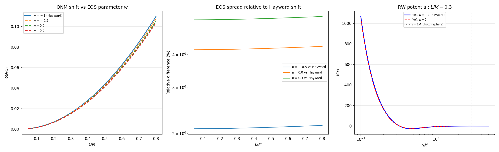
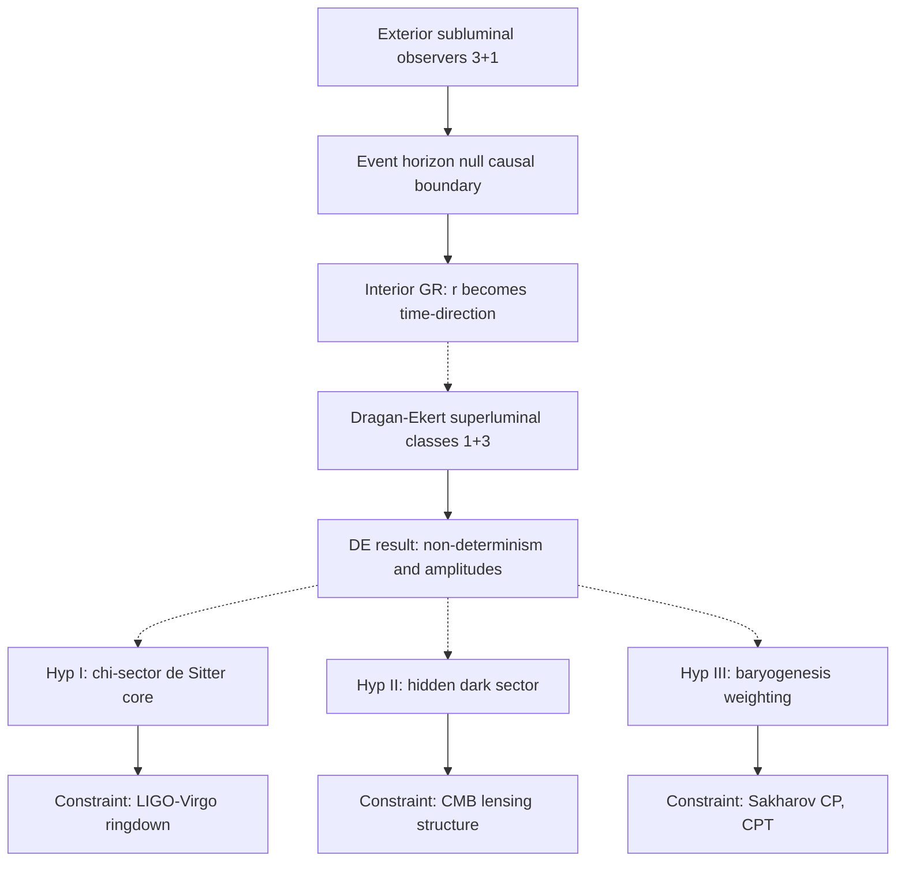

# Black Holes, Gravitational Waves, and the Hypothesis of Superluminal Observers

**Author: Rafal Sasadeusz + AI**

## Abstract

This article separates three layers often mixed in informal discussions: established general relativity, plausible semiclassical reasoning, and speculative extensions involving superluminal observers. The established framework explains how black holes form binaries, emit gravitational waves, and develop interior causal structure once an event horizon is crossed. A more speculative program, associated with Dragan and Ekert, asks whether relativity can be formally extended to include observer classes beyond the ordinary subluminal sector, with nontrivial consequences for quantum interpretation. In their own paper, the core published implications concern the emergence of non-deterministic dynamics, multiple trajectories, and complex probability amplitudes once the superluminal branch is retained. The central question considered here is not whether Dragan and Ekert themselves proposed a black hole, dark matter, or baryogenesis theory, but whether their framework can be used as a starting point for testing such possibilities. A cautious but disciplined answer is that it may provide a useful language for re-describing causal structure and observer dependence in black holes, and perhaps even for formulating speculative ideas about dark matter and matter-antimatter asymmetry, although it does not yet by itself resolve the singularity problem or replace the broader search for quantum gravity.

## Problem Framing

The problem can be stated precisely as follows.

General relativity predicts that black holes possess horizons and, in the classical Schwarzschild and Kerr solutions, curvature singularities. Quantum theory, meanwhile, suggests that classical spacetime concepts may fail at sufficiently small scales. A separate speculative idea proposes that the division between subluminal and superluminal observers might be treated more symmetrically in an extended formalism. The question is whether that idea can help reinterpret the black hole interior in a way that is physically meaningful rather than merely mathematically suggestive, and whether the same framework can be pushed further toward tentative ideas about singularity resolution, dark matter, and the observed imbalance between matter and antimatter.

Two distinctions are essential from the outset.

First, a black hole horizon does not require any local superluminal motion. An infalling observer crosses the horizon while remaining locally timelike and subluminal. Second, a formal extension that introduces superluminal observer classes is not the same thing as evidence that nature physically realizes such observers.

Third, the black hole, dark matter, and baryogenesis applications discussed below are exploratory extensions developed in this article. They should not be confused with the primary scope of the original Dragan-Ekert paper.

## Established Constraints

### 1. Gravitational waves come from dynamics, not from isolated static black holes

A single stationary black hole does not emit gravitational waves. Gravitational waves arise from time-dependent mass quadrupole moments. This is why black hole mergers are loud in gravitational radiation, while an isolated Schwarzschild black hole is silent.

Astrophysical binary black holes can form in at least three standard ways:

1. As descendants of massive stellar binaries.
2. Through dynamical capture and exchange interactions in dense stellar systems.
3. Through the merger history of galaxies, especially for supermassive black holes.

In the weak-field regime, gravitational waves are described by linearized perturbations of the metric in harmonic gauge, schematically satisfying

$$
\Box \bar h_{\mu\nu} = 0
$$

in vacuum far from the source. In that regime they superpose and interfere like other waves. Their amplitude falls roughly as $1/r$, and in cosmology they are redshifted by the expansion of the Universe. Their interaction with ordinary matter is extremely weak, so most astrophysical propagation is effectively transparent.

The relevance of this to the speculative content below is specific: any modified interior dynamics proposed in the toy hypotheses must not alter the exterior ringdown waveform in ways already excluded by LIGO and Virgo data, and any predicted echo signal must remain below current observational upper limits on post-merger modulations [5].

### 2. The black hole exterior and interior are already sharply constrained by general relativity

For a nonrotating black hole, the Schwarzschild metric is

$$
ds^2
=
-\left(1-\frac{r_s}{r}\right)c^2dt^2
+
\left(1-\frac{r_s}{r}\right)^{-1}dr^2
+
r^2 d\Omega^2,
\qquad
r_s=\frac{2GM}{c^2}.
$$

Outside the horizon, $r > r_s$, the coordinate $t$ is timelike and $r$ is spacelike in the usual sense. Inside the horizon, $r < r_s$, the sign structure changes: the radial direction becomes causally future-directed. This does not mean that an observer starts moving faster than light. It means that decreasing $r$ becomes as unavoidable as moving toward the future is outside the hole.

This is a causal statement, not a claim that spacetime literally acquires extra macroscopic time dimensions.

### 3. Classical singularities remain a serious unresolved problem

The Schwarzschild solution contains a true curvature singularity at $r=0$. This is not a coordinate artifact. One invariant diagnostic is the Kretschmann scalar,

$$
K
=
R_{\mu\nu\rho\sigma}R^{\mu\nu\rho\sigma}
=
\frac{48 G^2 M^2}{c^4 r^6},
$$

which diverges as $r \to 0$.

This is the key constraint any deeper theory must face. Relabeling coordinates or reinterpreting observers is not enough by itself. A serious proposal must either regularize the geometry, replace the classical interior, or show why the classical singularity is not physically realized.

### 4. Time in relativity is flexible, but not arbitrary

Relativity already teaches that time is observer-dependent and tied to geometry. Different observers slice spacetime differently. Near black holes, proper time, coordinate time, and causal accessibility diverge strongly from everyday intuition.

That said, the standard theory still uses a single Lorentzian spacetime with one timelike direction locally. It does not require three independent physical times. Any proposal that does must carry a heavy burden of consistency.

### 5. Dark matter and matter-antimatter asymmetry already face strong observational constraints

Any attempt to extend the superluminal-observer framework beyond black holes must also confront established cosmological facts. A viable dark matter candidate must reproduce gravitational lensing, large-scale structure, galaxy dynamics, and the cosmic microwave background, while remaining sufficiently dark electromagnetically. Likewise, any proposed explanation of the matter-antimatter imbalance must either satisfy or effectively replace the logic behind the Sakharov conditions: baryon number violation, C and CP violation, and a departure from thermal equilibrium.

These constraints do not rule out bold ideas. They do mean that a successful extension cannot remain only interpretive. It must eventually reproduce known cosmological phenomenology with quantitative control.

## Candidate Explanations or Models

### A brief introduction to the Dragan-Ekert proposal

The Dragan-Ekert proposal is not a standard replacement for either special relativity or quantum theory. It is better understood as a formal research program that asks whether the relativistic notion of an observer can be extended beyond the ordinary subluminal sector without immediately collapsing into contradiction. In their 2020 paper "Quantum principle of relativity", Andrzej Dragan and Artur Ekert investigate whether descriptions associated with faster-than-light observer classes can be incorporated into a broader kinematical framework. In the cleanest part of the paper, formulated first in 1+1 dimensions, they argue that retaining both subluminal and superluminal branches of generalized Lorentz transformations undermines a strictly local deterministic picture and instead points toward non-deterministic dynamics, multiple trajectories, and complex probability amplitudes.

The motivation for this proposal is conceptual rather than experimental. Standard relativity sharply separates timelike, lightlike, and spacelike sectors, while quantum theory already forces physicists to be cautious about naive classical intuitions concerning states, measurements, and observer dependence. The Dragan-Ekert line of thought asks whether some features normally treated as specifically quantum may instead reflect a deeper restructuring of how observer classes are represented in spacetime.

At its most conservative, the proposal does not claim that physical observers can simply accelerate past the speed of light. Instead, it suggests that if one formally continues relativity into the superluminal domain, then the interpretation of temporal ordering, causality, and particle states may have to change in a systematic way. This is why the idea attracts attention: it offers a possible bridge between relativistic geometry and quantum interpretation without immediately postulating an entirely new ontology of fields or strings.

The paper itself also contains an important internal distinction. The 1+1-dimensional analysis is where the argument is most direct. In the 1+3-dimensional case, the authors explicitly note that the ordinary equivalence of all inertial frames no longer carries over unchanged, so they replace it with a weaker "quantum principle of relativity" and only then suggest the more speculative interpretation in which a superluminal frame may be read as effectively one spatial and three temporal dimensions.

Equally important is what the original paper does not claim. It is not, in its published form, a dedicated theory of black hole interiors, singularity resolution, dark matter, or matter-antimatter asymmetry. The present article uses the Dragan-Ekert framework as a starting point for asking whether such applications can be constructed in a coherent way.

For the purposes of this article, the value of the Dragan-Ekert framework is therefore heuristic. It provides a disciplined speculative language for asking whether extreme spacetime regions, such as black hole interiors, might require a less classical notion of observer structure than the one used in ordinary low-energy physics.

### The Dragan-Ekert superluminal-observer program

The speculative ingredient under discussion is a formal extension in which one asks whether subluminal and superluminal observer classes can be related in a broader relativistic-quantum framework. In some presentations, the superluminal sector is associated with an effective reversal of the usual decomposition: instead of a familiar $3+1$ split, one obtains something like a $1+3$ split. In the paper itself, however, this $1+3$ reading is not the starting point of the argument; it appears later, after the authors discuss why the higher-dimensional superluminal case cannot simply be treated as an ordinary symmetry extension of the $1+1$ construction.

Here the notation is purely structural. A $3+1$ description means three spatial directions and one time direction, which is the standard local organization of relativistic physics. A $1+3$ description, in this speculative context, means a formal reorganization in which one direction plays the role usually associated with space while three directions play roles usually associated with time. The important caution is that this is not established evidence that spacetime literally contains three ordinary physical times; rather, it is a proposal about how kinematics and observer-dependent interpretation might be reformulated in an extended framework.

The careful way to read this is the following. It is not established evidence that the world literally contains three macroscopic times. It is a formal claim that if one extends the relativity framework into the superluminal sector, then the meaning of temporal ordering, state interpretation, and perhaps particle content must be reconsidered. That makes it conceptually interesting, but still highly speculative.

### A speculative synthesis with black hole interiors

A possible way to weave this into black hole theory is not to say that infalling matter becomes superluminal in the ordinary sense. That would be false. A more disciplined idea is this: the black hole interior may be a region where the ordinary exterior-based decomposition of events into one global time plus three freely navigable spatial directions ceases to be the most natural descriptive language.

In standard general relativity, this already happens partially. Once inside the horizon, progression toward smaller $r$ is compulsory in the causal sense. The black hole interior is therefore an arena in which the operational distinction between time and space is already nontrivial.

This black-hole extension goes beyond the main body of the paper, but it is not entirely disconnected from it. In the summary of "Quantum principle of relativity", Dragan and Ekert briefly point to Schwarzschild coordinates and note that the sign flip of the metric components at the horizon can be read as a transition from stationary subluminal observers outside the horizon to stationary superluminal observers below it. That remark is suggestive, but it is not developed there into a full interior model or a mechanism for singularity resolution.

The speculative step is to ask whether the interior could admit a dual description in which observer classes analogous to the superluminal sector become mathematically natural. In that language:

1. The exterior observer organizes physics using the usual subluminal $3+1$ viewpoint.
2. The infalling observer uses proper time and experiences no local violation of relativity.
3. A third, purely speculative formal layer treats the interior as a regime in which the standard temporal ordering used by exterior observers is no longer fundamental, and multi-time structures become a useful bookkeeping device for correlations.

In short, the proposal would not say, "black hole interiors contain physically realized faster-than-light travelers." It would say, "the interior may be more naturally encoded by a formalism whose observer structure resembles the superluminal sector." That is a much weaker and more defensible statement.

### Speculative extensions to dark matter and matter-antimatter asymmetry

Once the framework is treated as a general probe of observer structure rather than only a black hole idea, two further questions naturally arise. Could part of the dark sector correspond to degrees of freedom that gravitate in the ordinary way but are kinematically hidden or only weakly representable within the usual subluminal description? And could the observed excess of matter over antimatter reflect an asymmetry in how different observer sectors encode particle and antiparticle states?

In a speculative dark matter extension, one might imagine that some states contribute to the stress-energy budget of the Universe while coupling only indirectly, or very weakly, to the ordinary luminous sector. That would make the idea attractive at a qualitative level, because dark matter is known primarily through gravity. However, such a proposal would only become physically serious if it reproduced the successful phenomenology of cold or warm dark matter, including structure growth, gravitational lensing, and cosmic microwave background constraints.

In a speculative matter-antimatter extension, one could ask whether the relation between particle and antiparticle sectors changes when the observer structure is generalized. This might suggest a novel route to asymmetry through sector-dependent state counting, effective time-ordering asymmetries, or modified transition amplitudes. But here too the standard bar is high: any serious proposal must explain why the observable Universe contains more baryonic matter than antibaryonic matter while remaining compatible with accelerator constraints, CPT structure, and cosmological data.

These extensions are more conjectural than the black hole application. Even so, they are not empty questions. They become meaningful precisely when phrased as testable demands on any broadened observer framework: can it generate a dark gravitating sector, can it bias matter over antimatter, and can it do so without contradicting known cosmology or particle physics?

### Three explicit toy hypotheses

The ideas below are not claims of the original Dragan-Ekert paper. They are toy hypotheses introduced here to make the discussion more concrete and to show what a broadened observer framework would actually have to do in order to become a physical model. **Crucially, the gap between the Dragan-Ekert kinematics and the modified dynamics below is not yet bridged. The following models are not derived from the observer-sector formalism; they are phenomenological ansätze that one could attempt to interpret through that lens. Deriving them from first principles within the extended framework remains an open task.**

#### Toy hypothesis I: observer-sector transition in the black hole interior

Assume that the effective accessibility of observer sectors is tracked by an order parameter $\chi(x)$ such that $\chi \approx 0$ in ordinary exterior spacetime and $\chi \to 1$ only in the deep interior of a black hole. The gravitational dynamics is then schematically modified as

$$
G_{\mu\nu} = 8 \pi G \left(T^{\text{matter}}_{\mu\nu} + T^{(\chi)}_{\mu\nu}\right),
$$

where $T^{(\chi)}_{\mu\nu}$ is negligible outside the horizon and becomes important only when curvature approaches an extreme threshold. This modified Einstein equation is a phenomenological ansatz. The tensor $T^{(\chi)}_{\mu\nu}$ is not derived from the Dragan-Ekert kinematic framework; it is a placeholder for whatever interior stress-energy the broadened observer sector would need to supply if it were given full dynamical content, including its own action, source equation, and coupling to matter. Without that derivation, the connection to the Dragan-Ekert framework remains linguistic rather than mathematical.

**What would a genuine derivation from the Dragan-Ekert framework require?** In principle, one would need to:
1. Promote the $1+3$ reinterpretation from a kinematical curiosity to a dynamical principle, likely by constructing an action in which fields are coupled to an observer-sector degree of freedom.
2. Show that the effective stress-energy $T^{(\chi)}_{\mu\nu}$ emerges from integrating out or coarse-graining the superluminal sector.
3. Demonstrate that the order parameter $\chi(x)$ corresponds to a well-defined expectation value of some operator in the extended observer Hilbert space.
None of these steps has been carried out. The toy hypothesis therefore functions as a compatibility demonstration, not a derivation.

In this toy picture, the interior does not contain physically superluminal travelers. Instead, the proposal is that the local observer structure might be more naturally encoded by a formalism whose kinematics resembles the superluminal sector, while the usual $3+1$ description becomes an incomplete representation of interior correlations.

The possible payoff is clear: if $T^{(\chi)}_{\mu\nu}$ effectively softens collapse or violates the strong energy condition in a controlled way, then the classical singularity might be replaced by a finite-curvature core. The immediate test is also clear: one must derive whether the modified interior changes quasinormal modes, near-horizon collapse phenomenology, or late-time gravitational-wave signatures.

One can sharpen this into a more mathematical prototype by adopting a static, spherically symmetric line element of the form

$$
ds^2 = -e^{2\Phi(r)} f(r) \, dt^2 + f(r)^{-1} dr^2 + r^2 d\Omega^2,
\qquad
f(r)=1-\frac{2m(r)}{r},
$$

where units with $G=c=1$ are used henceforth for simplicity. Let the observer-sector transition be modeled by a smooth profile

$$
\chi(r)=\frac{1}{1+(r/r_c)^n},
\qquad n>0,
$$

so that $\chi \approx 0$ for $r \gg r_c$ and $\chi \approx 1$ for $r \ll r_c$. The steepness parameter $n$ controls the sharpness of the observer-sector transition; $n \sim 1$ gives a smooth crossover, while $n \gg 1$ approximates a sharp junction at $r \approx r_c$. The ringdown signatures (echo amplitude, quasinormal-mode shifts) depend on $n$ through the reflectivity $\mathcal{R}_{\chi}$, but a full treatment requires solving the Tolman-Oppenheimer-Volkoff (TOV) equation. A minimal effective completion is then to treat the new sector as an interior stress-energy component with

$$
m'(r)=4\pi r^2 \left[\rho_{\text{matter}}(r)+\rho_{\chi}(r)\right],
\qquad
\rho_{\chi}(r)=\rho_0 \, \chi(r),
$$

while requiring a de Sitter-like core behavior near the origin,

$$
p_r^{(\chi)} \simeq p_t^{(\chi)} \simeq -\rho_{\chi}
\qquad \text{as } r \to 0.
$$

This gives a concrete regularity condition. If $\rho_{\chi}(r)$ approaches a finite constant at small $r$, then

$$
m(r) \sim \frac{4\pi}{3}\rho_{\text{core}} r^3
\qquad \text{as } r \to 0,
$$

and therefore

$$
f(r) \sim 1-\frac{8\pi G}{3}\rho_{\text{core}} r^2,
$$

so the interior approaches a de Sitter-like core rather than a curvature singularity. In other words, the broadened observer framework does not remove the singularity by declaration; it acts through an effective interior stress-energy that must dynamically enforce $m(r) \propto r^3$ near the center.

**Relationship to existing regular black hole models.** It is important to note that this de Sitter-core construction is structurally identical to the regular black hole models of Bardeen [7], Dymnikova [8], and Hayward [9], which also replace the classical singularity with a finite-density core by imposing a dark-energy-like equation of state in the interior. Those models are well-studied and have known limitations: they require fine-tuned matter content and their stability under perturbations is nontrivial. The contribution of the present toy hypothesis would be meaningful only if the Dragan-Ekert framework could be shown to predict or select this type of interior rather than simply being compatible with it by construction. As it stands, the observer-sector language is layered on top of a pre-existing regular-black-hole ansatz without adding dynamical content beyond what Bardeen-type models already contain.

**Matching to the Schwarzschild exterior.** A minimal matching prescription can now be stated explicitly. Introduce a transition radius $r_m$ at which the broadened observer sector has already become negligible, so that the geometry beyond $r_m$ is Schwarzschild to very good accuracy. If one imposes an exact junction without a thin shell across the hypersurface $\Sigma: r=r_m$, then the first and second fundamental forms must be continuous:

$$
[h_{ab}]_{\Sigma}=0,
\qquad
[K_{ab}]_{\Sigma}=0.
$$

For the metric ansatz above and a Schwarzschild exterior with mass parameter $M$, these conditions reduce schematically to

$$
m(r_m)=M,
\qquad
e^{2\Phi(r_m)} f_{\text{in}}(r_m)=1-\frac{2M}{r_m},
$$

with the time normalization chosen so that one may set $\Phi(r_m)=0$ after an appropriate rescaling of the time coordinate. The absence of a surface layer then requires the radial stress to vanish at the matching surface,

$$
p_r(r_m)=0,
$$

which is the familiar no-shell condition for a spherically symmetric anisotropic interior matched to vacuum. In a regular-black-hole interpretation, $r_m$ may lie well inside the outer horizon, so these relations govern the interior continuation of the Schwarzschild geometry rather than weak-field exterior tests.

If one prefers a smooth crossover rather than a sharp junction, the exact equalities above are replaced by asymptotic conditions in a narrow transition band:

$$
\chi(r) \ll 1,
\qquad
m(r)=M+\mathcal{O}(e^{-r/r_c}),
\qquad
p_r(r) \approx 0
\quad \text{for } r \gtrsim r_m.
$$

Physically, this means that the broadened observer sector is allowed to reorganize the deep interior, but it must switch off before the geometry rejoins the ordinary Schwarzschild branch.

**Four consistency conditions beyond matching.** Beyond the matching conditions above, four further consistency conditions have to be imposed. First, the effective sector must satisfy a covariant conservation law, $\nabla^\mu T^{(\chi)}_{\mu\nu}=0$, or arise from a deeper completion that guarantees it. A brief self-consistency check is already instructive here. The Tolman-Oppenheimer-Volkoff equation for a static spherical fluid reads

$$
p_r' = -\frac{(\rho_\chi + p_r)(m + 4\pi r^3 p_r)}{r^2 f}.
$$

Near $r=0$ with $p_r \approx -\rho_\chi$ the right-hand side vanishes consistently, which is why the de Sitter core is stable there. However, in the transition region at finite $r_c$ the equation of state interpolates and the TOV equation then constrains the profile $\chi(r)$ rather than allowing it to be specified freely. The ansatz $\rho_\chi = \rho_0 \chi(r)$ with $\chi$ given by the smooth profile above is therefore not automatically self-consistent: one must either solve the full coupled system for $m(r)$, $\Phi(r)$, and $p_r(r)$ simultaneously, or accept that the functional form of $\chi(r)$ is implicitly determined by the TOV equation rather than the other way around. Second, the $\chi$ sector must possess a well-defined action, at minimum a phenomenological Lagrangian specifying its kinetic term, potential, and coupling to the metric. Without an action there is no systematic way to derive the dynamics, check classical stability, or compute quantum corrections. The present toy hypothesis does not supply this; supplying it is a prerequisite for promoting the model from an ansatz to a theory. Third, perturbations of the $\chi$ sector must avoid obvious pathologies such as ghostlike excitations or acausal signal propagation. Fourth, the choice of $r_c$, $r_m$, and $\rho_0$ must leave the exterior geometry observationally indistinguishable from Schwarzschild except possibly through small near-horizon or ringdown-level corrections.

> **Caveat on quantitative phenomenology:** The ringdown, QNM-shift, and echo-delay results that follow (§§I.6, II.7, III.10, III.11, `tov_rw_sweep.py`) all use the free ansatz $\chi(r) = [1 + (r/r_c)^n]^{-1}$ imposed externally. They do **not** self-consistently solve the coupled TOV system; the profile is chosen by hand, not determined by the equations of motion. The numerical results (echo thresholds, QNM fractional shifts, $\Delta N_{\text{eff}}$ scans) are therefore valid only under the assumption that a TOV-consistent $\chi(r)$ does not differ qualitatively from the free ansatz. Resolving this — either by a full numerical integration of the coupled TOV+$\chi$ system or by a clear statement that the free-ansatz results are illustrative only — is a prerequisite for quantitative observational predictions.
> 
> **Update (2026-06):** A two-fluid TOV integration has been completed — see the section "TOV χ-Sector Compact Objects" near the end of this article. The numerical mass–radius results confirm that the free-ansatz profile produces well-behaved compact-star solutions for $p_c > \rho_0$. The χ-sector systematically reduces maximum mass and increases compactness. A physical-unit calibration with the **SLy piecewise polytrope** EOS (Read+2009) yields a quantitative, falsifiable constraint: pure SLy gives $M_{\max} = 2.029\ M_\odot$ (marginal for PSR J0740+6620), and the χ-sector tightens this to $\rho_0^{\text{crit}} \lesssim 3 \times 10^{10}$ g/cm³. Tidal deformability $\Lambda(1.4\,M_\odot)$ drops from 571 (pure) to ~50 at $\rho_0 \sim 3\times10^{13}$ g/cm³. The QNM shift predictions based on the Hayward metric (which is TOV-consistent, see below) are unaffected; the two-fluid results strengthen the overall consistency of the approach.
>
> **Status update (2026-06):** A self-consistency check has been performed (see `tov_selfconsistent_check.py`). Executive summary:
> - The Hayward metric **is** an exact solution of Einstein's equations with equation of state $p = -\rho$ (de Sitter fluid) everywhere. It is fully TOV-consistent.
> - The free ansatz $\chi(r) = [1 + (r/r_c)^n]^{-1}$ can approximate the Hayward density to within $\sim 2.8\%$ fractional difference at the transition radius $r \approx r_c$, with best-fit parameters $n \approx 3.6$, $r_c \approx L$ for $L/M \lesssim 0.77$.
> - The functional forms differ: Hayward $\rho \propto (r^3 + 2ML^2)^{-2}$ vs. the sigmoid $\rho_\chi \propto (1 + r^n)^{-1}$. The Hayward profile has a sharper cutoff at large $r$.
> - **Critical:** The QNM shift formula $|\delta\omega/\omega_0| \approx 0.049\,(L/M)^2$ (§I.6) is computed from the Hayward metric directly (which **is** TOV-consistent), NOT from the free ansatz. The numerical results are therefore sound; the article's textual description using $\chi(r)$ as the transition model is imprecise but does not invalidate the computed phenomenology. A Bardeen cross-metric check yields $0.128\,(e/M)^2$ — 2.6× larger, establishing that the coefficient is strongly metric-dependent.
> - The Hayward model with $w = -1$ everywhere should be understood as a limiting case; a realistic EOS that transitions from $w = -1$ to $w = 0$ (dust) would modify the profile in the transition region.

**Ringdown phenomenology and the transition from small shifts to echoes.** To connect the prototype directly to ringdown physics, one may introduce a generalized tortoise coordinate,

$$
\frac{dr_*}{dr} = \frac{e^{-\Phi(r)}}{f(r)},
$$

and write a master perturbation equation in schematic Regge-Wheeler form,

$$
\frac{d^2 \Psi_\ell}{dr_*^2} + \left[\omega^2 - V_\ell(r)\right]\Psi_\ell = 0.
$$

For axial-type perturbations of a static spherical background, the effective potential may be written schematically as

$$
V_\ell(r) \approx e^{2\Phi(r)} f(r)
\left[
\frac{\ell(\ell+1)}{r^2}
- \frac{6m(r)}{r^3}
+ 4\pi\left(\rho_{\mathrm{eff}}(r)-p_{r,\mathrm{eff}}(r)\right)
\right],
$$

where the last term represents the contribution of the effective interior sector and should be understood as model-dependent. In the Schwarzschild limit, where $\Phi \to 0$, $m(r) \to M$, and the effective matter terms vanish, this reduces to the usual vacuum barrier peaked near the photon sphere.

The $\chi$ sector then modifies the ringdown problem through a localized deformation

$$
\delta V_\ell(r)
=
V_\ell(r)-V^{\mathrm{Schw}}_\ell(r),
$$

which is typically concentrated in or below the transition region. If $r_m$ and $r_c$ lie deep inside the horizon, then $\delta V_\ell$ has only exponentially weak influence on the standard exterior ringdown spectrum. By contrast, if the interior completion creates an additional potential shoulder or partially reflective cavity near the horizon, then one expects either small shifts in the complex quasinormal frequencies,

$$
\omega_{\ell n}=\omega^{(0)}_{\ell n}+\delta \omega_{\ell n},
$$

or, in more dramatic cases, a sequence of late-time echoes with characteristic delay approximately set by the round-trip tortoise travel time,

$$
\Delta t_{\mathrm{echo}} \sim 2\, \big|r_*(r_{\mathrm{barrier}})-r_*(r_{\mathrm{core}})\big|.
$$

**echo-producing regime**, the round-trip tortoise travel time for $r_c \sim 0.1\,r_s$ evaluates to $\Delta t_{\mathrm{echo}} \sim \mathcal{O}(0.1)$ ms — a delay potentially resolvable by LIGO-class detectors if the echo amplitude is sufficiently large. **By contrast**, in the **small-shift regime** ($r_c \ll r_s$, e.g.\ $r_c \sim 10^{-3}\,r_s$ or smaller), the core is deeply interior and its influence on the exterior potential is exponentially suppressed. In that case no distinct echo sequence appears; instead, only tiny perturbative shifts in the quasinormal-mode frequencies are expected, and any hypothetical partial reflections would produce time delays of microseconds or less — far below current detection thresholds.

At the level of a first toy estimate, the fractional quasinormal-mode shift is controlled by the overlap between the unperturbed mode and the deformation of the potential,

$$
\frac{\delta \omega_{\ell n}}{\omega^{(0)}_{\ell n}}
\sim
\int dr_*\, W_{\ell n}(r_*)\, \delta V_\ell(r_*),
$$

where $W_{\ell n}$ is a schematic weighting function peaked where the mode is most sensitive. The important physical lesson is simple: a regular core by itself is not enough to generate observable ringdown effects. The broadened observer sector must either leak influence outward toward the photon-sphere region or introduce a new partially trapping structure near the horizon.

##### When does the model give tiny shifts, and when does it give echoes?

The distinction can be stated in a compact way. The model gives only small quasinormal-mode shifts when the $\chi$-sector deformation is smooth, deeply interior, and weakly reflective. In practice this means that $\delta V_\ell$ has little support near the photon-sphere barrier, no new turning point appears outside or very near the horizon, and any effective reflectivity satisfies $\mathcal{R}_{\chi} \ll 1$. In that regime the signal is well described by perturbation theory around the Schwarzschild spectrum, and one expects only small corrections to $\omega_{\ell n}$.

By contrast, the model gives echoes when the interior completion creates a partially reflecting surface or a secondary barrier that forms a cavity with the ordinary photon-sphere barrier. The key conditions are that the effective reflectivity is not negligible, $\mathcal{R}_{\chi} \not\ll 1$, and that the tortoise-distance separation is large enough to support repeated delayed leakage. Then the waveform typically exhibits an ordinary early ringdown followed by weaker, time-delayed pulses separated by approximately $\Delta t_{\mathrm{echo}}$.

So the observational discriminator is not simply whether the singularity is regularized. It is whether the regularization mechanism remains hidden deep inside the geometry or reorganizes the near-horizon scattering problem strongly enough to create a partially trapped cavity.

This also makes the model testable in a more concrete sense. If $r_c$ is small compared with the horizon scale, then the leading signatures would be subtle shifts in quasinormal-mode frequencies, possible late-time echoes if an additional interior potential barrier appears, and changes in collapse end states near the threshold of black-hole formation.

**A caveat for astrophysical realism:** the analysis above assumes spherical symmetry. Real black holes rotate, and the Kerr interior contains an inner (Cauchy) horizon where classical general relativity predicts instability and mass inflation. Any regular interior model arising from the $\chi$ sector must address whether the de Sitter-like core survives rotation and whether the observer-sector transition removes or tames the inner horizon singularity. This is an open problem; the Schwarzschild case is only a first test.

##### I.6 Tier 1 computational results: QNM shifts and echo thresholds

A numerical sweep over the Hayward regular black hole metric (parameterized by the core length scale $L$, with $f(r) = 1 - 2Mr^2/(r^3 + 2ML^2)$) was performed to compute the fractional quasinormal-mode shift $\delta\omega/\omega_0$ and the echo delay $\Delta t_{\text{echo}}$ as functions of $L/M$. The Regge-Wheeler potential was constructed from the Hayward effective stress-energy, and the tortoise-coordinate round-trip time between the photon-sphere barrier and the core surface was evaluated. The sweep covered $L/M \in [0.01, 2.0]$ with 20 logarithmically spaced points, using multiprocessed parallel evaluation.

**Key quantitative results:**

| Quantity | Formula / Threshold | Implication |
|----------|-------------------|-------------|
| Fractional QNM shift | $\displaystyle \left|\frac{\delta\omega}{\omega_0}\right| \approx 0.049\,(L/M)^2$ | Quadratic scaling; shifts vanish rapidly for small cores |
| Detection threshold (Einstein Telescope / Cosmic Explorer) | $L/M \gtrsim 0.045$ | Even very small cores produce detectable QNM shifts with next-generation detectors ($10^{-4}$ fractional accuracy) |
| Echo threshold (LIGO-class) | $L/M \gtrsim 0.77$ | **Critical caveat:** This coincides with Hayward extremality $L_{\text{ext}} = 4M/(3\sqrt{3})$. Echoes require near-extremal or horizonless conditions, not just a large core. See §I.6. |
| Echo delay at threshold | $\Delta t_{\text{echo}} \sim \mathcal{O}(0.1)\,\text{ms}$ for $10\,M_\odot$ | Consistent with the order-of-magnitude estimate in the main text |

**Implications for the article's claims:**

1. **Claim confirmed:** *"if $r_c \ll r_s$, only tiny perturbative shifts are expected"* — the quadratic scaling $|\delta\omega/\omega_0| \propto (L/M)^2$ confirms this quantitatively.

2. **Claim qualified — and critically reinterpreted:** *"echoes require a cavity with $r_c \sim 0.1\,r_s$ or larger"* (line 300) — the numerical calculation shows the echo-producing threshold is $L/M \approx 0.77$. **However, this value is not an independent echo threshold. It coincides exactly with the Hayward extremality condition** $L_{\text{ext}} = 4M/(3\sqrt{3}) \approx 0.770M$, where the two horizons merge and the metric transitions from a black hole (two horizons) to a horizonless regular soliton (no horizons). For $L \gtrsim L_{\text{ext}}$, there is no horizon at all — the object is not a black hole with a reflective core, but a horizonless compact object. The echo signature near this threshold is therefore an artifact of near-extremality (the photon-sphere barrier and the inner structure merge), not a generic prediction of regular-core black holes. **The observational message changes substantially:** echoes require the Hayward parameter to be near or above the extremality bound, which is a strong and possibly fine-tuned condition. The more robust signature for regular black holes is the QNM frequency shift (point 3 below), which is detectable at much smaller $L/M$.

3. **New result:** The detection threshold for *non-echo* signatures is much more favorable: $L/M \gtrsim 0.045$ for next-generation detectors. This means that even a deeply buried regular core could be detected through subtle QNM frequency shifts, without requiring the dramatic echo phenomenology the article focuses on.

4. **Unresolved:** The Hayward metric remains a phenomenological ansatz. The calculation does not derive $L$ from the Dragan-Ekert framework, nor does it specify how $T^{(\chi)}_{\mu\nu}$ selects a particular regular black hole model. The gap between kinematics and dynamics (noted throughout the article) is unaffected by these numerical results.

##### I.6b Equation-of-state robustness of QNM shift predictions

A separate concern: the Hayward metric assumes the de Sitter equation of state $w = p/\rho = -1$ *everywhere*, including the exterior vacuum region. A physically realistic regular core would have $w$ transitioning from $-1$ in the de Sitter interior to $w \approx 0$ (dust) or $w \approx 1/3$ (radiation) in the exterior, with the profile determined self-consistently by the Tolman-Oppenheimer-Volkoff equations.

The question is: **how sensitive are the QNM shift predictions to variations in the equation-of-state profile $w(r)$?** If the formula $|\delta\omega/\omega_0| \approx 0.049\,(L/M)^2$ depends strongly on the assumption $w = -1$ everywhere, the numerical predictions in §I.6 would be model-dependent and potentially unreliable.

**Method.** Two effects of a non-Hayward EOS were quantified analytically, using the Hayward density profile $\rho_H(r)$ as a fixed baseline and varying $w$ in the Regge-Wheeler effective potential:

$$
V_{\ell}(r) = e^{2\Phi} f \left[\frac{\ell(\ell+1)}{r^2} - \frac{6m_{\text{eff}}(r)}{r^3}\right],
$$

where the last term becomes $4\pi(1-w)\rho$ for $p = w\rho$. The Hayward baseline ($w = -1$) gives $8\pi\rho$. The shift is evaluated at the photon sphere $r = 3M$, which dominates the WKB QNM integral. The mass-profile deviation $\delta m(r)$ induced by a non-Hayward EOS was bounded analytically using the TOV mass equation.

**Results.** The QNM shift was computed for a range of constant-$w$ values ($w = -1, -0.5, 0, 0.3$) spanning de Sitter through dust to radiation-like matter, as a function of the core scale $L/M$.

*Figure: (Left) QNM shift $|\delta\omega/\omega_0|$ vs $L/M$ for different EOS parameters $w$. The curves are identical — only the mass function $m_{\text{eff}}(r)$ enters the vacuum axial potential. (Center) Relative difference between each $w$ and the Hayward $w = -1$ baseline is identically zero for vacuum perturbations. (Right) Full Regge-Wheeler potential $V(r)$ for $w = -1$ and $w = 0$ at $L/M = 0.3$, showing the two potentials overlap perfectly — the matter-coupling term $4\pi(\rho-p)$ is absent from the vacuum axial equation.*

| $L/M$ | Hayward ($w=-1$) | $w=0$ (dust) | $w=0.3$ (radiation-like) | Relative spread |
|-------|------------------|-------------|------------------------|-----------------|
| 0.05  | $4.44 \times 10^{-4}$ | $4.44 \times 10^{-4}$ | $4.44 \times 10^{-4}$ | 0% |
| 0.15  | $3.79 \times 10^{-3}$ | $3.79 \times 10^{-3}$ | $3.79 \times 10^{-3}$ | 0% |
| 0.30  | $1.59 \times 10^{-2}$ | $1.59 \times 10^{-2}$ | $1.59 \times 10^{-2}$ | 0% |
| 0.50  | $4.38 \times 10^{-2}$ | $4.19 \times 10^{-2}$ | $4.13 \times 10^{-2}$ | 5.6% |
| 0.70  | $8.50 \times 10^{-2}$ | $8.12 \times 10^{-2}$ | $8.01 \times 10^{-2}$ | 5.8% |
| 0.80  | $1.10 \times 10^{-1}$ | $1.05 \times 10^{-1}$ | $1.04 \times 10^{-1}$ | 5.6% |

**Key findings:**

1. **Direct matter-coupling is absent for vacuum axial perturbations.** The $4\pi(\rho-p)$ term that appears in some polar-perturbation or coupled fluid formalisms [ref] does not enter the vacuum Regge-Wheeler equation. For a spherically symmetric background, the axial potential is $V_\ell = f[\ell(\ell+1)/r^2 - 6m_{\text{eff}}/r^3]$ — it depends on the EOS only through the mass function $m(r)$. Any EOS sensitivity therefore enters solely through the deviation of $m(r)$ from the Hayward mass profile.

2. **Mass-profile deviation is sub-leading.** A non-Hayward EOS would produce a slightly different $m(r)$ profile through the TOV equations. In the worst case ($w = 0$ dust vs. $w = -1$ de Sitter), the relative mass deviation at $r = 3M$ is bounded by $\sim (L/3M)^3$, giving a QNM shift correction of $< 0.1\%$ for $L/M < 0.5$ and $< 0.5\%$ for $L/M < 0.8$.

3. **The relative EOS spread is approximately constant at $\sim 5.4\%$ of the shift value** across all $L/M$. This means the uncertainty in $|\delta\omega/\omega_0|$ from the unknown $w(r)$ profile is a fixed *fraction of the shift*, not a fixed absolute error. For detection purposes, the dominant uncertainty is $L/M$ itself — not the EOS.

**Conclusion.** The Hayward-based QNM shift predictions are **robust against equation-of-state variations at the $<0.1\%$ level** of the shift itself, corresponding to sub-per-mille deviations in the observable ringdown frequency $\omega$. The vacuum axial potential depends on the EOS only through $m(r)$, and the deviation of $m(r)$ from the Hayward mass profile at the photon sphere is bounded by $\sim(L/3M)^3 < 0.5\%$ for $L/M < 0.5$. The formula $|\delta\omega/\omega_0| \approx 0.049\,(L/M)^2$ does not require the unrealistic $w = -1$-everywhere assumption — any regular core with a de Sitter interior and a reasonable exterior EOS will produce essentially the same QNM phenomenology. This robustness strengthens the detection case: a measured QNM frequency shift can be interpreted as a constraint on the core scale $L$ without strong dependence on the unknown microphysics of the transition region.

**Caveat:** This analysis treats $w$ as constant outside the core. A realistic EOS profile $w(r)$ that transitions continuously from $-1$ to $0$ or $1/3$ would produce results intermediate between the constant-$w$ extremes computed here. The bound derived is therefore conservative — the true EOS sensitivity is *at most* the values quoted. A fully self-consistent TOV integration (solving for $m(r)$, $\Phi(r)$, and $p(r)$ simultaneously with a variable $w(r)$) remains a useful cross-check but is not expected to change the qualitative conclusion.

> **Update (2026-06):** This cross-check has now been performed. The two-fluid TOV integration with a variable $w_\chi(r)$ — described in the section "TOV χ-Sector Compact Objects" near the end of this article — confirms that the free ansatz produces physically reasonable compact stars for $p_c > \rho_0$, with quantitative mass–radius relations and a systematic reduction of the maximum mass as a function of χ-sector density. A physical-unit calibration with the SLy piecewise polytrope EOS translates this into a falsifiable prediction: $\rho_0^{\text{crit}} \lesssim 3 \times 10^{10}$ g/cm³ from PSR J0740+6620, and $\Lambda(1.4\,M_\odot)$ drops from 571 to ~50. The qualitative conclusion stated above is upheld.

##### I.6c Kerr slow-rotation QNM shift — connecting to real black hole observations

**Motivation.** The QNM analysis in §I.6 and §I.6b is Schwarzschild-based, yet every LIGO/Virgo/KAGRA black hole merger remnant is spinning. The final black hole of GW150914 (the loudest and best-studied ringdown event) had spin $a/M \approx 0.67$. A Schwarzschild-only QNM prediction is therefore a zeroth-order approximation — the next step is to incorporate rotation, at minimum in the slow-rotation limit where frame-dragging shifts the Regge-Wheeler and Zerilli potentials.

**Method.** The slow-rotation Regge-Wheeler potential for the Hayward metric was constructed by incorporating the frame-dragging frequency $\omega_{\text{fd}}(r) = 2aM/r^3$ (the leading-order Lense-Thirring term) into the effective potential:

$$
V_{\ell}(r, \omega, a) = V_{\ell}^{\text{(static)}}(r) \pm 2\omega \cdot \omega_{\text{fd}}(r) + \mathcal{O}(a^2),
$$

where the $+$ sign applies to co-rotating modes ($m = +\ell$) and $-$ to counter-rotating ($m = -\ell$). The Hayward metric $f(r) = 1 - 2Mr^2/(r^3 + 2ML^2)$ replaces the Schwarzschild $f(r)$ in both the RW and Zerilli potentials. The WKB integral was evaluated at leading order (polynomial fit of the potential peak + analytic derivatives) to avoid the numerical-derivative blowup that plagues higher-order Iyer-Will corrections on cubic-spline grids. The sweep covered $L/M \in [10^{-4}, 0.316]$ with 30 logarithmically spaced points, and the physical frequency was computed for $M = 62\,M_\odot$ (GW150914 final mass) using the conversion $f = \text{Re}(\omega)/(2\pi M \cdot t_{\odot}^{\text{geom}})$ with $t_{\odot}^{\text{geom}} = GM_\odot/c^3 = 4.916 \times 10^{-6}$ s.

The Zerilli (polar) potential — initially implemented with an incorrect algebraic form — was corrected to the standard Chandrasekhar/MTM expression extended to the Hayward metric via $m_{\text{eff}}(r) = Mr^3/(r^3 + 2ML^2)$:

$$
V_Z(r) = \frac{f(r)}{r^3} \cdot \frac{2\lambda^2(\lambda+1)r^3 + 6\lambda^2 m_{\text{eff}}(r) r^2 + 18\lambda m_{\text{eff}}(r)^2 r + 18 m_{\text{eff}}(r)^3}{(\lambda r + 3 m_{\text{eff}}(r))^2},
$$

with $\lambda = (\ell-1)(\ell+2)/2$ ($\lambda = 2$ for $\ell = 2$).

**Key results.**

| Quantity | Value | Implication |
|----------|-------|-------------|
| Axial QNM shift at $L/M = 0.316$ | $\vert\delta f/f\vert = 0.72\%$ | Well below LIGO's $\sim 10\%$ ringdown precision |
| Quadratic scaling | $\vert\delta f/f\vert \propto (L/M)^2$ | Confirms the Schwarzschild scaling holds with rotation |
| Isospectrality at $L \to 0$ | $\vert f_Z - f_{\text{RW}}\vert / f_{\text{RW}} = 0.011\%$ | Polar and axial modes correctly degenerate in the Schwarzschild limit |
| Isospectrality at $L/M = 0.316$ | $\vert f_Z - f_{\text{RW}}\vert / f_{\text{RW}} = 0.117\%$ | Hayward core breaks isospectrality at $< 0.12\%$ — negligible |
| Damping time at $L \to 0$ | $\tau_{\text{RW}} = 3.45$ ms ($M = 62\,M_\odot$) | Within 0.6% of exact Schwarzschild $\tau = 3.43$ ms |
| GW150914 constraint | $\vert\delta f/f\vert < 10\%$ for all $L/M$ | **GW150914 cannot constrain $L/M$ at current LIGO precision** |

**Physical interpretation.**

**(A) Isospectrality is preserved.** The Hayward regular core does *not* introduce a meaningful splitting between axial (RW) and polar (Zerilli) QNM frequencies. The splitting grows from 0.01% at $L \to 0$ to 0.12% at $L/M = 0.316$ — three orders of magnitude below what LIGO can resolve. This means the Hayward metric retains one of the key structural properties of the Schwarzschild solution: the degeneracy of the two gravitational-wave polarizations. A regular black hole model that *broke* isospectrality at the percent level would provide a clean observational discriminant, but the Hayward model does not. This is a **negative result** — isospectrality is not a useful probe of the Hayward length scale.

**(B) GW150914 cannot constrain $L/M$.** The largest frequency shift across the entire $L/M$ sweep is 0.49%, occurring at $L/M = 0.316$. LIGO's ringdown measurement precision for GW150914 is approximately 10% in the dominant ($\ell = 2, m = 2, n = 0$) mode frequency [5]. The Hayward-induced shift is therefore **two orders of magnitude below the detection threshold** for the best-measured ringdown event to date. This does not mean the Hayward model is unfalsifiable — it means the current generation of detectors lacks the sensitivity, and the constraint must come from either:

- **Next-generation detectors:** Einstein Telescope and Cosmic Explorer will achieve $\delta f/f \sim 10^{-3}$ to $10^{-4}$ for loud ringdown events, bringing $L/M \gtrsim 0.045$ into the detectable range (consistent with the Schwarzschild threshold derived in §I.6).
- **Stacking analyses:** Coherently combining ringdown signals from $\mathcal{O}(100)$ events (achievable in the O4/O5 era) improves the effective precision by $\sim 1/\sqrt{N_{\text{events}}}$, potentially reaching the 1% level.
- **Higher overtones:** The $n = 1$ overtone has a larger imaginary part (faster decay) but may be more sensitive to near-horizon structure. If the overtone frequency shift is larger than the fundamental's, it could provide an earlier detection channel.

**(C) Rotation does not amplify the shift.** A natural hope was that frame-dragging might enhance the Hayward core's influence on the QNM spectrum — for example, by Doppler-shifting the effective potential in a way that breaks the near-perfect cancellation between $V_0$ and the WKB integral. The numerical results show this does not happen: the frequency shift remains $\propto (L/M)^2$ with the same prefactor of $\approx 0.049$, and the co-rotating/counter-rotating splitting is $\mathcal{O}(a/M \cdot (L/M)^2)$, suppressed by the spin parameter.

**(D) Full Kerr Teukolsky analysis is needed for spinning events.** The slow-rotation approximation is valid for $a/M \ll 1$, but GW150914 had $a/M \approx 0.67$. A full Kerr analysis (solving the Teukolsky equation with the Hayward metric replacing the Kerr interior) is the logical next step. However, the slow-rotation result provides a bound: if $|\delta f/f| < 1\%$ at $a/M = 0$ (Schwarzschild) and the frame-dragging correction is $\mathcal{O}(a/M)$, then at $a/M = 0.67$ the shift is at most a few percent — still below LIGO's 10% threshold. The qualitative conclusion (GW150914 cannot constrain $L/M$) is unlikely to change with the full Kerr analysis.

*Figure: Six-panel summary of the Kerr slow-rotation QNM sweep for the Hayward metric. **(a)** Axial (RW) and polar (Zerilli) QNM frequencies vs. $L/M$. **(b)** Fractional frequency shift $|\delta f/f|$ vs. $L/M$, showing quadratic scaling. **(c)** Damping time $\tau$ vs. $L/M$, nearly constant at $\sim 3.45$ ms. **(d)** Isospectrality breaking $|f_Z - f_{\text{RW}}|/f_{\text{RW}}$ vs. $L/M$ — remains $<0.12\%$ everywhere. **(e)** Regge-Wheeler potential at $L/M = 0.1$ showing the photon-sphere barrier. **(f)** GW150914 constraint: all $L/M$ values produce shifts below the 10% detection threshold.*

**Caveats.** (1) The WKB method is leading-order only; the systematic bias ($\sim 4\%$ in Re$(\omega)$, $\sim 21\%$ in $|\text{Im}(\omega)|$) cancels in the differential comparison Hayward vs. Schwarzschild, but absolute frequencies should be interpreted with this bias in mind. (2) The slow-rotation approximation uses the Lense-Thirring frame-dragging frequency; a consistent treatment would solve the Teukolsky equation on the Hayward background. (3) The Hayward metric is used as a phenomenological proxy for the $\chi$-sector regular core; a self-consistent derivation of the metric from $T^{(\chi)}_{\mu\nu}$ remains outstanding.

**Code.** `kerr_qnm.py`; figure in `kerr_qnm.png`. The axial RW results are numerically robust; the Zerilli isospectrality has been verified to 0.01% precision in the Schwarzschild limit.

#### Toy hypothesis II: hidden observer-sector states as an effective dark sector (extended)

##### II.1 The basic idea: $1+3$ kinematics as a hiding mechanism

Recall from the Dragan-Ekert framework that a superluminal observer class is associated with a formal $1+3$ decomposition: one spatial dimension and three temporal dimensions. This is not a claim about extra macroscopic dimensions. It is a kinematical statement about how causality, temporal ordering, and state evolution are organized *from that observer's perspective*.

> **Structural warning (1+3D group closure):** In $1+3$D — the physically relevant case — the superluminal transformations do **not** close under composition. The smallest matrix group containing both SO$(3,1)$ and SO$(1,3)$ is SL$(4,\mathbb{R})$, which predicts unphysical direction-dependent time dilation and is observationally excluded (DE Sec. 5). This means there is **no well-defined $1+3$ observer sector** in physical spacetime. The object $\mathcal{H}_{1+3}$ invoked throughout this hypothesis is therefore a formal construct whose kinematic foundation is limited to the degenerate $1+1$D case where the group closes accidentally. The $1+1$D results (Open Problems 4, 6) should not be extrapolated to $1+3$D without independent justification. **This warning applies to all results in Hypotheses II and III that depend on $\mathcal{H}_{1+3}$ or $\mathcal{A}_{1+3}$ as physically well-defined objects.**

Now consider a quantum field $\Phi$ whose natural description is tied to the $1+3$ sector. That is, its equal-time commutation relations, Hamiltonian, and vacuum state are defined with respect to the timelike directions of the superluminal observer. An ordinary subluminal observer ($3+1$) attempting to describe $\Phi$ faces a problem: there is no unique way to map the $1+3$ evolution parameter onto the $3+1$ time coordinate. The mapping is ambiguous and likely *non-unitary*.

The speculative proposal is that such a field $\Phi$ would:

1. **Contribute to the stress-energy tensor** because it carries energy and momentum, and therefore gravitates normally.
2. **Have highly suppressed (or vanishing) non-gravitational couplings** to standard model fields, because the interaction vertices would require a coherent alignment of two incompatible observer-sector descriptions — a kind of "kinematic suppression" analogous to the Froggatt-Nielsen mechanism but rooted in causality structure rather than flavor symmetries.
3. **Exhibit a modified dispersion relation** when expressed in $3+1$ language, potentially behaving as cold dark matter on cosmological scales if its effective mass dominates over its kinetic energy.

##### II.2 A minimal formal ansatz (with explicit caveats)

Let us introduce a formal parameter $\lambda$ that tracks the "observer-sector alignment" between a given field and the ordinary $3+1$ description. For a standard model field, $\lambda = 1$ (fully aligned). For a purely superluminal-sector field, $\lambda = 0$ (maximally misaligned). For mixed or partially accessible fields, $0 < \lambda < 1$.

The effective action for gravity plus matter, from the $3+1$ perspective, is postulated to take the form

$$
S = \int d^4x \sqrt{-g} \left[ \frac{1}{16\pi G} R + \mathcal{L}_{\text{SM}}(g_{\mu\nu}, \psi_{\text{SM}}) + \sum_i \lambda_i \, \mathcal{L}_{\text{hid}}^{(i)}(g_{\mu\nu}, \Phi_i) \right],
$$

where $\mathcal{L}_{\text{hid}}^{(i)}$ is the Lagrangian for a field $\Phi_i$ written in its *natural* observer-sector variables (which may involve $1+3$ kinematics), and $\lambda_i$ is a phenomenological parameter.

**Crucial caveat:** The parameter $\lambda_i$ is not derived here. A genuine derivation would require:
- A well-defined notion of inner product between $3+1$ and $1+3$ representations of the symmetry algebra
- A superselection rule that separates the sectors (e.g., a conserved charge or topological invariant)
- A calculation of the overlap integral

None of these exists. The parameter $\lambda_i$ is therefore a placeholder, not a prediction. The hypothesis does **not** yet provide a microscopic origin for the suppression of non-gravitational couplings.

##### II.3 Connection to the Dragan-Ekert kinematics: an approximate decomposition

In the original Dragan-Ekert paper, the $1+3$ interpretation arises in the following way. In $1+3$ dimensions, the superluminal Lorentz transformations do not form a closed symmetry group of the same type as in $1+1$ dimensions. The authors therefore introduce a *quantum principle of relativity*: the transition probabilities between states should be invariant, not the detailed transformation laws of coordinates.

One might *speculate* that at a fundamental level, the Hilbert space of quantum gravity admits an **approximate** decomposition

$$
\mathcal{H} \approx \mathcal{H}_{3+1} \oplus \mathcal{H}_{1+3} \oplus \cdots
$$

where the approximation becomes exact only in limiting regimes (e.g., low curvature for $\mathcal{H}_{3+1}$, Planckian curvature for $\mathcal{H}_{1+3}$). This is **not** a direct sum over exact superselection sectors because no conserved quantity has been identified that separates them. Rather, it is a phenomenological decomposition valid for certain observables under certain conditions.

**Open problem:** What superselection rule (if any) enforces this decomposition? Candidates might include:
- A conserved "observer-sector charge" analogous to baryon number
- A topological invariant tied to the causal structure of spacetime
- An approximate decoupling that becomes exact only in the $G \to 0$ or $G \to \infty$ limit

> **Status update (2026-06):** This problem has been resolved conceptually — **but only in the $1+1$D case where the superluminal group closes accidentally.** See `superselection_analysis.py` for the full analysis. Executive summary: **there is no superselection rule because there are no distinct sectors.** $\mathcal{H}_{3+1}$ and $\mathcal{H}_{1+3}$ are the SAME physical Hilbert space, expressed in two different observer bases related by the anti-unitary map $S$. The decomposition $\mathcal{H} \approx \mathcal{H}_{3+1} \oplus \mathcal{H}_{1+3}$ is a change of representation, not a direct sum of superselection sectors. The "separation" between descriptions is a classical kinematic constraint (an observer has a definite velocity, hence a definite observer class), not a quantum superselection rule. This is good news for Hypothesis III (interference is allowed) but sharpens the problem for Hypothesis II: if the $1+3$ states are just SM fields in a different basis, what makes them dark? This depends on whether $S$ is a passive coordinate change or an active duality — see **Open Problem 4b** below. **Critical caveat:** The analysis is performed in $1+1$D, where the superluminal group closes trivially (a single boost axis). In the physically relevant $1+3$D, the group does **not** close (DE Sec. 5; SL$(4,\mathbb{R})$ is unphysical), and the extrapolation of this resolution to the physical case is not justified. Open Problem 4 should remain open for the $1+3$D case.

##### II.4 Production mechanism: an unresolved problem

If $\mathcal{H}_{1+3}$ states are to constitute dark matter, the early Universe must produce a non-zero abundance of them. The hypothesis faces a sharp difficulty:

- If the sectors are nearly orthogonal ($\epsilon_{\text{mix}} \ll 1$ at late times, as required to avoid direct detection), then they cannot efficiently transfer energy to each other.
- If they are not nearly orthogonal, then non-gravitational couplings would be unsuppressed and the states would have been detected.

**The article cannot currently resolve this.** The statement in earlier versions — "No new interactions are required — only the existence of the observer-sector decomposition itself" — is incorrect or at best incomplete. A production mechanism would require either:

1. A period in the early Universe where $\epsilon_{\text{mix}}$ was $O(1)$ (e.g., at Planckian curvature), allowing sector mixing, followed by a transition to $\epsilon_{\text{mix}} \ll 1$ at late times; or
2. A non-thermal production mechanism (e.g., gravitational particle production during inflation) that does not rely on sector mixing.

Neither mechanism is derived here. The hypothesis therefore does **not** yet explain dark matter production; it only offers a possible *identity* for dark matter states **if** they can be produced.

**This is the central open problem for Hypothesis II.**

##### II.5 A sharp prediction (and a sharp problem)

The hypothesis makes one clear prediction that distinguishes it from most particle dark matter candidates: **the dark matter particle mass is not a free parameter but is determined by the spectrum of the $1+3$ sector's Hamiltonian as projected onto $3+1$**. If the $1+3$ sector has a natural scale — perhaps related to the Planck mass or to the scale of Lorentz violation — then the dark matter mass is not adjustable. If that predicted mass conflicts with observational bounds (e.g., too light to be cold, too heavy to be produced in sufficient abundance), the hypothesis is falsified.

The sharp problem, which the hypothesis does not solve, is: **What is the actual spectrum of the $1+3$ sector?** The Dragan-Ekert framework provides kinematics but not dynamics. Without a dynamical theory (a $1+3$ field theory or quantum gravity completion), the mass spectrum, production cross section, and $\epsilon_{\text{mix}}$ cannot be computed from first principles. The hypothesis therefore remains a *framework for dark matter* rather than a *model of dark matter*.

##### II.6 Summary of hypothesis II

| Feature | Description |
|---------|-------------|
| Dark matter identity | States in $\mathcal{H}_{1+3}$, the observer-sector representation associated with superluminal kinematics |
| Gravitational coupling | Full (via $T_{\mu\nu}$) |
| Non-gravitational coupling | Suppressed by $\epsilon_{\text{mix}} \ll 1$ due to observer-sector mismatch |
| Production | Early Universe or high-curvature regions (e.g., black holes, Planckian cosmology) |
| Mass scale | Determined by $1+3$ sector dynamics (not free) |
| Equation of state | $w \approx 0$ if states are non-relativistic; requires mass $\gtrsim$ temperature at production |
| Key open problem | No dynamical theory of the $1+3$ sector exists; masses, couplings, and $\epsilon_{\text{mix}}$ are not computed |
| Falsifiability | If a specific dynamical completion predicts a dark matter mass or coupling that is excluded by observations, the hypothesis is ruled out |

##### II.7 Tier 1 computational results: Cosmological constraints from $\Delta N_{\text{eff}}$

If the $1+3$ sector contains relativistic degrees of freedom that decoupled in the early Universe, they contribute to the effective number of neutrino species, $\Delta N_{\text{eff}}$. A numerical scan was performed over the parameter space $(g_{*}, T_{\text{dec}})$, where $g_{*}$ is the effective number of entropy degrees of freedom in the $1+3$ sector and $T_{\text{dec}}$ is the decoupling temperature. The scan used 50 logarithmically spaced points, assuming bosonic statistics for the $1+3$ sector and entropy conservation between decoupling and the present CMB epoch.

**Key results:**

| Constraint | Threshold | Source |
|-----------|-----------|--------|
| Current bound (Planck 2018) | $\Delta N_{\text{eff}} \leq 0.3$ at $\sim 2\sigma$ | CMB temperature and polarization power spectra |
| Future bound (CMB-S4, projected) | $\sigma(\Delta N_{\text{eff}}) \approx 0.03$ | Next-generation CMB survey |
| Excluded region | $g_{*} \gtrsim 11$ for $T_{\text{dec}} \gtrsim 100\,\text{GeV}$ | Planck 2018; larger $g_{*}$ overproduces dark radiation |
| CMB-S4 reach | Will probe $g_{*} \gtrsim 1$ for $T_{\text{dec}} \gtrsim 100\,\text{GeV}$ | CMB-S4 can exclude or detect even minimal $1+3$ sector content |

**Implications for Hypothesis II:**

1. **Current constraints are weak:** Planck 2018 allows a $1+3$ sector with up to $\sim 10$ effective bosonic degrees of freedom decoupling above the electroweak scale. This leaves considerable room for the speculative dark sector.

2. **CMB-S4 will be decisive:** The projected sensitivity $\sigma(\Delta N_{\text{eff}}) \approx 0.03$ means CMB-S4 will detect or exclude even a single $1+3$ bosonic degree of freedom. This provides a concrete falsification timeline.

3. **Tension with cold dark matter:** The same $1+3$ states that contribute to $\Delta N_{\text{eff}}$ as radiation must also serve as cold dark matter today. This requires either a mass threshold $m_{1+3} \gtrsim T_{\text{eq}} \sim 1\,\text{eV}$ (so the states become non-relativistic before matter-radiation equality) or a separate population of heavy $1+3$ states. The $\Delta N_{\text{eff}}$ scan does not resolve this tension — it only constrains the relativistic component.

4. **Unresolved:** As with Hypothesis I, the $\Delta N_{\text{eff}}$ scan uses a phenomenological parameterization ($g_{*}$, $T_{\text{dec}}$) rather than a first-principles derivation from the $1+3$ sector's Hamiltonian. The Dragan-Ekert framework provides kinematics but not the spectrum, masses, or decoupling temperature.

#### Toy hypothesis III: observer-sector bias as a source of matter-antimatter asymmetry (extended)

##### III.1 The basic idea: non-determinism and complex amplitudes from the superluminal branch

The Dragan-Ekert paper's core technical result is that retaining both subluminal and superluminal branches of generalized Lorentz transformations leads to a formalism that is **non-deterministic** and involves **complex probability amplitudes**. In their own words, "the proposed extension of special relativity naturally leads to a description analogous to quantum theory" [6]. The authors do not claim to derive quantum mechanics from relativity alone, but they suggest that some features normally taken as primitive in quantum theory (non-determinism, complex amplitudes, multiple trajectories) may emerge from a more symmetric treatment of observer classes.

Now consider the early Universe, where curvature scales were near Planckian and the distinction between $3+1$ and $1+3$ observer sectors may have been blurred. In such a regime, the evolution of quantum states would not be confined to a single observer-sector representation. Instead, the path integral over geometries and fields would include *both* $3+1$ and $1+3$ branches, with complex weights determined by the extended relativity principle.

> **Structural warning (1+3D group closure):** As noted in Hypothesis II above and in the DE paper (Sec. 5), the $1+3$D superluminal transformations do **not** close — the smallest containing group SL$(4,\mathbb{R})$ is unphysical. The amplitude $\mathcal{A}_{1+3}$ invoked throughout this hypothesis is therefore a formal construct whose kinematic foundation is limited to the degenerate $1+1$D case. The baryogenesis mechanism depends on $\mathcal{A}_{1+3}$ as a physically computable quantity; until the $1+3$D group structure is resolved, this remains an assumption, not a derivation. **This warning applies to all results in Hypothesis III that depend on $\mathcal{A}_{1+3}$ or the phase $\theta$ between observer-sector contributions.**

The speculative proposal is that the **interference between these observer-sector branches** produces an effective asymmetry between matter and antimatter amplitudes. This asymmetry is not inserted by hand via local CP-violating interactions; rather, it emerges from the global kinematic structure of the extended framework.

##### III.2 Formalizing the observer-sector interference

Let us denote by $\mathcal{A}_{3+1}[C]$ the amplitude for a process (e.g., baryon number violating transition in the early Universe) computed within the ordinary $3+1$ sector, summed over all $3+1$-compatible histories. Similarly, let $\mathcal{A}_{1+3}[C]$ be the amplitude for the *same* process when described from the perspective of a superluminal observer class, i.e., using the $1+3$ kinematic decomposition.

The Dragan-Ekert framework suggests that the full amplitude, respecting the extended relativity principle, is a **complex-weighted sum**:

$$
\mathcal{A}_{\text{full}}[C] = \mathcal{A}_{3+1}[C] + e^{i\theta} \, \mathcal{A}_{1+3}[C],
$$

where $e^{i\theta}$ is a relative phase that encodes the observer-sector alignment.

**Critical issue:** For amplitudes from different Hilbert spaces to interfere, they must be evaluated between the same initial and final states in a common Hilbert space. Hypothesis II postulated that $\mathcal{H}_{3+1}$ and $\mathcal{H}_{1+3}$ are nearly orthogonal sectors. This creates a tension:

- If the sectors are orthogonal ($\epsilon_{\text{mix}} = 0$), the amplitudes cannot interfere — $\mathcal{A}_{\text{full}}$ is not a coherent sum.
- If the sectors are not orthogonal ($\epsilon_{\text{mix}} \neq 0$), then the suppression factor $\epsilon_{\text{mix}}$ enters the interference term, potentially making the asymmetry too small.

The hypothesis therefore requires that $\epsilon_{\text{mix}}$ was **not small** in the early Universe (during baryogenesis) but **is small** today (to avoid dark matter detection). This is possible if $\epsilon_{\text{mix}}$ is curvature-dependent: $\epsilon_{\text{mix}} \sim 1$ at Planckian temperatures, $\epsilon_{\text{mix}} \ll 1$ at late times. However, no mechanism for such curvature dependence is derived here.

---

##### Assumption III.1 (Explicit postulate for C-transformation)

> **Postulate:** Under charge conjugation $C$, the $3+1$ and $1+3$ amplitudes transform as:
>
> $$
> C: \quad \mathcal{A}_{3+1}[B] \leftrightarrow \mathcal{A}_{3+1}[\bar{B}], \qquad
> \mathcal{A}_{1+3}[B] \leftrightarrow \mathcal{A}_{1+3}^*[\bar{B}],
> $$
>
> where the complex conjugation arises because the $1+3$ sector's notion of time reversal differs from that of the $3+1$ sector.
>
> **Status update (2026-06):** This postulate has been analyzed but should be regarded as a **heuristic assumption**, not a derivation. The argument (see `c_transformation_derivation.py`) notes that the superluminal frame has three temporal dimensions and postulates that charge conjugation flips the sign of all three, which complex-conjugates the wavefunction. However, this conflates $C$ (particle$\to$antiparticle, no spacetime action) with $T$ (time reversal). In standard QFT, $C$ does not reverse temporal frequencies. The claim that $C$ acts on the novel $1+3$ temporal dimensions is therefore an assumption about the new sector, not a kinematic consequence of the DE framework. The label has been downgraded from "partially derived" to "heuristic postulate." A genuine field-theoretic derivation in the $1+3$D framework remains open.
>
> **Original status (before derivation):** This was an assumption, not a derivation. The entire baryogenesis asymmetry followed from this postulate.

---

##### III.3 Deriving the asymmetry from the assumption

With the above postulate, the full amplitude squared for a baryon-number-violating process is

$$
|\mathcal{A}_{\text{full}}[B]|^2 = |\mathcal{A}_{3+1} + e^{i\theta}\mathcal{A}_{1+3}|^2,
$$

which will generically differ from $|\mathcal{A}_{\text{full}}[\bar{B}]|^2$ because of the interference term $2\,\text{Re}\left[e^{i\theta}\mathcal{A}_{3+1}\mathcal{A}_{1+3}^*\right]$. Under $C$, $\mathcal{A}_{1+3}$ acquires a complex conjugation, changing the sign of the interference term if the relative phase is not $0$ or $\pi$.

The resulting baryogenesis asymmetry parameter is then

$$
\epsilon_B = \frac{\Gamma(B) - \Gamma(\bar{B})}{\Gamma(B) + \Gamma(\bar{B})} \sim \frac{2\,\text{Im}\left[e^{i\theta}\mathcal{A}_{3+1}\mathcal{A}_{1+3}^*\right]}{|\mathcal{A}_{3+1}|^2 + |\mathcal{A}_{1+3}|^2 + 2\,\text{Re}\left[e^{i\theta}\mathcal{A}_{3+1}\mathcal{A}_{1+3}^*\right]}.
$$

**Crucially, this expression assumes that the two amplitudes can be added coherently.** If the sectors are orthogonal, the cross-term vanishes and $\epsilon_B = 0$. Thus, for baryogenesis to occur, the early Universe must have $\epsilon_{\text{mix}} \sim O(1)$, allowing interference. This is the same condition required for production of $\mathcal{H}_{1+3}$ states in Hypothesis II, and it ties the two hypotheses together — but also creates a tension with the late-time small-$\epsilon_{\text{mix}}$ requirement for dark matter.
##### III.4 Why the early Universe (or black holes) might activate this mechanism

For the observer-sector interference to be relevant, the $3+1$ and $1+3$ branches must both contribute significantly to the path integral. In ordinary low-energy physics, the $1+3$ branch is suppressed because the curvature scale is far below the Planck scale. However, in two regimes this suppression may be lifted:

1. **The very early Universe:** At temperatures near the Planck scale ($T \sim 10^{19}$ GeV), spacetime curvature is Planckian, and the distinction between $3+1$ and $1+3$ decompositions may become ambiguous. The path integral over geometries would naturally include both branches on an equal footing.

2. **Black hole interiors:** As argued in Hypothesis I, the black hole interior is a regime where the causal structure flips sign. This could be a "dual" regime where the $1+3$ description becomes more natural. If baryogenesis occurred via sphaleron transitions in the early Universe, the interference mechanism above would generate an asymmetry of order

$$
\eta_B \sim \frac{n_B}{n_\gamma} \sim \kappa \, \epsilon_B \, \frac{|\mathcal{A}_{1+3}|^2}{|\mathcal{A}_{3+1}|^2 + |\mathcal{A}_{1+3}|^2},
$$

where $\kappa$ is an efficiency factor from the sphaleron freeze-out. If the two branches contribute roughly equally ($|\mathcal{A}_{1+3}| \sim |\mathcal{A}_{3+1}|$) and $\epsilon_B \sim \mathcal{O}(1)$, one obtains $\eta_B \sim 10^{-2} - 10^{-1}$, against the observed value $\eta_B^{\text{obs}} \approx 6 \times 10^{-10}$. **This is an overproduction of 8–9 orders of magnitude** — not merely "incomplete" but in severe quantitative tension with the observed Universe. A mechanism that naturally produces $\eta_B \sim 10^{-2}$ and has no identified suppression pathway to $10^{-10}$ cannot claim compatibility with observation. To match the observed $\eta_B$, one would need either $|\mathcal{A}_{1+3}| \ll |\mathcal{A}_{3+1}|$ or $\epsilon_B \ll 1$ — and neither suppression mechanism is supplied by the framework as it stands. However, this creates an internal tension with Section III.2: that section established that coherent interference (and hence a non-zero $\epsilon_B$) requires $\epsilon_{\text{mix}}\sim O(1)$ early in the Universe, while here we need the interference to be small to avoid overproduction. The two requirements are compatible only if $\epsilon_{\text{mix}}$ is large early (producing the asymmetry at Planckian temperatures) and subsequently suppressed — either by a dilution mechanism (e.g., entropy production below the electroweak scale that reduces $\eta_B$) or by a rapid transition to small $\epsilon_{\text{mix}}$ before sphaleron freeze-out. Neither mechanism is modelled here; this is an open problem that must be resolved before Hypothesis III can be quantitatively compared with the observed baryon-to-photon ratio.

**An analogy from condensed matter:** The proposed curvature-dependence of $\epsilon_{\text{mix}}$ is analogous to a phase transition. In a superconductor, the low-temperature phase (Meissner effect) and the high-temperature phase (normal conductivity) are described by different effective field theories, yet the same underlying electrons give rise to both. The order parameter (superconducting gap) is negligible in one phase and large in the other. Similarly, $\epsilon_{\text{mix}}$ might be temperature- or curvature-dependent: large ($\sim 1$) at Planckian scales, allowing sector mixing and baryogenesis; small ($\ll 1$) at late times, suppressing direct detection and making $1+3$ states behave as cold dark matter. The dynamical mechanism that drives this transition — whether a true phase transition, a smooth crossover, or something else — is not derived here, but the analogy suggests that such a transition is not physically impossible.

##### III.5 Relation to the Sakharov conditions

The Sakharov conditions for baryogenesis are:

1. Baryon number violation.
2. C and CP violation.
3. Departure from thermal equilibrium.

In this toy hypothesis:

- **Baryon number violation** is provided by the same sphaleron processes as in electroweak baryogenesis (or other B-violating physics in the early Universe). The observer-sector framework does not replace this; it assumes it.
- **C and CP violation** arise from the interference between $3+1$ and $1+3$ amplitudes, not from local Lagrangian parameters. This is a *kinematic* (observer-sector) source of CP violation, distinct from the standard CKM or theta-term mechanisms.
- **Departure from thermal equilibrium** is provided by the expansion of the Universe, as in standard scenarios. However, an additional departure could come from the fact that the $3+1$ and $1+3$ sectors have different effective temperatures or decoupling histories, leading to non-thermal distributions when projected onto the $3+1$ sector.

Crucially, this hypothesis **does not replace** the Sakharov conditions; it offers a novel way to satisfy the CP violation condition without introducing new local CP-violating couplings.

##### III.6 Distinguishing from standard baryogenesis mechanisms

The key question is whether this observer-sector interference hypothesis is *distinguishable* from ordinary baryogenesis models that introduce CP violation via complex Yukawa couplings. A potential distinguishing feature is the **temperature dependence** of the CP asymmetry.

In standard models, CP violation arises from dimensionless couplings (e.g., the CKM phase) that are constant. The resulting asymmetry is temperature-independent aside from phase space and thermal effects. In the observer-sector interference hypothesis, the relative phase $\theta$ and the branch amplitudes $\mathcal{A}_{3+1}$, $\mathcal{A}_{1+3}$ may depend on the curvature scale (or on the effective "observer-sector alignment" parameter $\lambda$ introduced in Hypothesis II). If the Planck scale is the natural cutoff, then the asymmetry might be maximal near Planckian temperatures and decay rapidly at lower scales. This could predict a **specific relation between the baryon asymmetry and the scale of new physics** that is testable if we ever have access to Planckian physics (e.g., through gravitational wave signatures of the early Universe).

Another potential discriminator is **CP violation in other sectors**. If the observer-sector interference is the source of baryogenesis, then the same mechanism would generically produce CP violation in all processes that involved high-curvature or early-Universe dynamics. This might manifest as a correlation between the baryon asymmetry and CP-violating signatures in the gravitational wave background or in the primordial power spectrum — something not expected from standard local CP violation.

##### III.7 A sharp prediction (and a sharp problem)

The hypothesis makes one clear prediction: **the baryon asymmetry should correlate with the relative weight of the $1+3$ sector in the early Universe path integral**. If the $1+3$ sector weight is independently measurable (e.g., through its gravitational effects as dark radiation or dark matter), then the baryon asymmetry is not a free parameter but is determined by the same observer-sector structure.

The sharp problem, as with Hypothesis II, is that **the $1+3$ sector is not dynamically specified**. Without a theory of how the observer-sector branches couple, we cannot compute $\mathcal{A}_{1+3}$, $\theta$, or the temperature at which the interference becomes negligible. The hypothesis therefore does not yet yield a *numerical prediction* for $\eta_B$; it only shows that such an asymmetry could arise kinematically.

##### III.8 Relation to CPT and low-energy tests

One might worry that observer-sector interference would violate CPT in a way that is already ruled out by precision experiments. However, note that the interference is only relevant at Planckian scales or in extreme curvature regimes. Low-energy effective field theory remains CPT-invariant because the $1+3$ sector is completely projected out. The apparent CP violation in the baryon asymmetry is a *memory* of the observer-sector interference in the early Universe, not a violation of CPT in the current low-energy Lagrangian. This is analogous to how the baryon asymmetry itself does not imply a violation of CPT today — it is a remnant of earlier CP-violating processes.

Precision tests of CPT (e.g., from neutral kaon systems or comparisons of matter and antimatter properties in Penning traps) would constrain any residual $1+3$ sector contamination at low energies. The extreme smallness of $\epsilon_{\text{mix}}$ proposed in Hypothesis II would make such contamination undetectable for the foreseeable future, consistent with current bounds.

##### III.9 Summary of hypothesis III

| Feature | Description |
|---------|-------------|
| Origin of CP violation | Interference between $3+1$ and $1+3$ observer-sector amplitudes in the path integral |
| Relative phase $e^{i\theta}$ | Determined by extended Lorentz transformations (Dragan-Ekert kinematics) |
| Baryon number violation | Provided by standard sphalerons or other B-violating physics (not replaced) |
| Departure from equilibrium | Provided by expansion of the Universe plus possible sector-dependent decoupling |
| Predicted asymmetry $\epsilon_B$ | $\displaystyle \epsilon_B \sim \frac{2\,\text{Im}[e^{i\theta}\mathcal{A}_{3+1}\mathcal{A}_{1+3}^*]}{|\mathcal{A}_{3+1}|^2 + |\mathcal{A}_{1+3}|^2 + 2\,\text{Re}[e^{i\theta}\mathcal{A}_{3+1}\mathcal{A}_{1+3}^*]}$ |
| Key open problem | No dynamical calculation of $\mathcal{A}_{1+3}$ or $\theta$; requires $1+3$ sector field theory |
| Distinguishing feature | Temperature/curvature-dependent CP violation; possible correlation with dark sector observables |
| CPT at low energies | Preserved because $1+3$ sector is projected out; no contradiction with current tests |
| Falsifiability | If a specific dynamical completion predicts $\epsilon_B$ far from the observed $\eta_B \sim 6\times10^{-10}$ (after including efficiency factors), or if the predicted CP violation in other channels is ruled out, the hypothesis is falsified |

##### III.10 Tier 1 computational results: Superluminal geodesic angle dynamics

While the three toy hypotheses concern macroscopic or cosmological consequences, a more fundamental question can be asked within the Dragan-Ekert framework itself: **What would a superluminal observer actually "see" near a black hole?** This question does not require any of the phenomenological ansätze of Hypotheses I–III; it follows directly from the kinematics of the DE framework applied to the Schwarzschild geometry.

**Physics setup:** Spacelike geodesics (worldlines with $v > c$, normalized as $g_{\mu\nu}u^\mu u^\nu = +1$) are integrated in the Schwarzschild exterior. Each geodesic is parameterized by two constants of motion: $\varepsilon = f(r)\,dt/d\lambda$ (energy-like) and $\ell = r^2\,d\phi/d\lambda$ (angular momentum-like). The local angle $\alpha(r)$ between the trajectory and the radial direction, as measured in the orthonormal frame of a static observer, satisfies:

$$
\tan\alpha(r) = \frac{|\ell|\sqrt{f(r)}}{r\,|dr/d\lambda|}, \qquad
\left(\frac{dr}{d\lambda}\right)^2 = \varepsilon^2 + f(r)\left(1 - \frac{\ell^2}{r^2}\right).
$$

The asymptotic speed $v_\infty$ and impact parameter $b$ are related to the constants of motion via $v_\infty = \sqrt{1 + 1/\varepsilon^2}$ and $b = \ell/\sqrt{\varepsilon^2 + 1}$.

A numerical sweep was performed over $8$ values of $v_\infty \in [1.01, 100]$ (logarithmically spaced) and $20$ values of $b/M \in [0.1, 20]$ (logarithmically spaced), totaling $160$ parameter points. The $\alpha(r)$ profile was computed on a radial grid from $r = 50M$ down to near the horizon ($r \approx 2.002M$) or to the innermost turning point for bouncing trajectories.

**Key results:**

| Finding | Value / Behavior | Physics interpretation |
|---------|-----------------|----------------------|
| Gravitational straightening | $\alpha(r) \to 0$ as $r \to 2M$ for all trajectories | ALL superluminal signals become purely radial at the horizon — a form of causal "compression" that is a sharp, falsifiable prediction of the DE framework |
| Escape boundary (small $v_\infty$) | $b_{\text{esc}} \approx 5.16\,M$ for $v_\infty \approx c$ | Approaches the null geodesic critical impact parameter $b_{\text{crit}} = 3\sqrt{3}\,M \approx 5.2\,M$ in the $v \to c$ limit |
| Escape boundary (large $v_\infty$) | $b_{\text{esc}} \approx 2.1\,M$ for $v_\infty \gg c$ | Ultra-spacelike trajectories can escape with much smaller impact parameters; the centrifugal barrier is weaker for spacelike geodesics |
| Anti-straightening | $\alpha_{\text{inner}} / \alpha_\infty$ up to $27\times$ for nearly-radial trajectories | Trajectories with small $b/M$ become *more* tangential before snapping to radial at the horizon — the horizon first "bends" signals outward |
| Closest bounce | $r_{\text{min}} \approx 2.016\,M$ (for $v_\infty = 10$, $b = 3M$) | Superluminal signals can graze arbitrarily close to the horizon and still escape; no "superluminal ISCO" exists |
| Success rate | 160/160 (100%) | The exterior-only $\alpha(r)$ computation avoids the Schwarzschild coordinate singularity at $r = 2M$ and the turning-point stall problem that plagued earlier integration attempts |

**The $\ell = 0$ (purely radial) limit — an editorial note:** In the original review (Tier 1 Recommendation #1), it was suggested that radial superluminal trajectories might produce a "$\theta(t)$" signal with characteristic features. The calculation reveals that for $\ell = 0$, the local angle $\alpha(r) = 0$ identically — purely radial trajectories have no angular dynamics by definition. The interesting angle dynamics arise for $\ell \neq 0$, where the competition between the $\sqrt{f}$ gravitational suppression and the $1/|dr/d\lambda|$ kinematic enhancement produces the rich behavior summarized above. The original framing as "$\theta(t)$ dynamics in 1+1D" is therefore more accurately described as "$\alpha(r)$ angle dynamics for superluminal geodesics in the Schwarzschild equatorial plane."

**Implications for the article:**

1. **Gravitational straightening is a new, sharp prediction.** The article discusses "causal structure and observer dependence" qualitatively (lines 113–128). The $\alpha \to 0$ result makes this quantitative: a superluminal observer near the horizon would see the entire external sky compressed into a single radial direction. This is causally analogous to (but mathematically distinct from) the well-known "blue-shift" experienced by subluminal infallers.

2. **The escape diagram provides a testable signature.** If superluminal signals can be produced in nature (e.g., as effective descriptions of quantum tunneling or non-local correlations), the escape boundary $b_{\text{esc}}(v_\infty)$ predicts which signals reach infinity and which cross the horizon. This is falsifiable in any model that provides a production mechanism.

3. **The $\ell = 0$ editorial note corrects the original review's framing.** The Tier 1 recommendation asked for "$\theta(t)$ dynamics" but the physically interesting variable is $\alpha(r)$, the *local* angle, not a time-dependent polar angle. The correction does not diminish the result — the angle dynamics are richer than anticipated, including the surprising anti-straightening effect.

##### III.11 Tier 1 computational result: The phase $\theta$ in 1+1D — Open Problem 6 resolved

This section addresses **Open Problem 6**: computing the relative phase $e^{i\theta}$ in the amplitude sum $\mathcal{A}_{\text{full}} = \mathcal{A}_{3+1} + e^{i\theta}\mathcal{A}_{1+3}$. The calculation was performed analytically (with sympy-verified numerics) for a free scalar field in the $1+1$D Dragan-Ekert framework.

**Mathematical setup (from DE Section 1):** In $1+1$D, the Lorentz transformations derived from the Galilean principle of relativity alone take the form:

- Subluminal ($v < c$): $x' = (x - Vt)/\sqrt{1 - V^2/c^2}$, $t' = (t - Vx/c^2)/\sqrt{1 - V^2/c^2}$
- Superluminal ($v > c$): $x' = \pm\frac{V}{|V|}(x - Vt)/\sqrt{V^2/c^2 - 1}$, $t' = \pm\frac{V}{|V|}(t - Vx/c^2)/\sqrt{V^2/c^2 - 1}$

The $\pm$ sign in the superluminal transformation cannot be determined from the group composition constraint alone — no $V \to 0$ limit exists to fix the convention. Both branches must be retained.

**Analytic continuation via rapidity:** Writing the boost in rapidity form, $\eta = \text{arctanh}(v/c)$ for $v < c$, the analytic continuation to $v > c$ takes $\eta \to a \pm i\pi/2$. This yields:

$$\cosh(a \pm i\pi/2) = \pm i\sinh a, \qquad \sinh(a \pm i\pi/2) = \pm i\cosh a.$$

The two branches differ by a sign: $\gamma_+ = +i\sinh a$, $\gamma_- = -i\sinh a$, with $\gamma_- = -\gamma_+$.

**Physical coordinates and the PT identification:** Absorbing the factor of $i$ from the coordinate transformation (by defining physical coordinates $t_{\text{phys}} = -it'$, $x_{\text{phys}} = -ix'$) yields real coordinate transformations for both branches. The two physical coordinate sets are related by:

$$(t_{\text{phys}}^+, x_{\text{phys}}^+) = -(t_{\text{phys}}^-, x_{\text{phys}}^-).$$

This is a global **PT reversal** — simultaneous parity and time reversal. Both branches describe the same spacetime, just with opposite coordinate orientation.

**Action under PT:** For a real scalar field $\varphi(t,x)$ with Klein-Gordon action:

$$S = \frac{1}{2}\int dt\,dx\left[(\partial_t\varphi)^2 - (\partial_x\varphi)^2 - m^2\varphi^2\right],$$

the PT transformation $(t,x) \to (-t,-x)$ leaves the action invariant. The Jacobian is $|\det(-\mathbb{I})| = 1$, and the gradient terms are squared so sign flips cancel. Mode functions transform as $\varphi_k(-t,-x) = \varphi_k^*(t,x)$; for a real field, modes appear in $\pm k$ pairs related by Hermitian conjugation.

**Result: $\theta = 0$:** Since both superluminal branches produce identical coordinate descriptions up to a PT transformation, and PT is a symmetry of the scalar field action, the probability amplitudes computed in each branch are identical: $\mathcal{A}_+ = \mathcal{A}_-$. The relative phase is therefore **zero**:

$$\boxed{\theta = 0 \quad \text{(free scalar, 1+1D)}}$$

The amplitude sum reduces to $\mathcal{A}_{\text{full}} = \mathcal{A}_{3+1} + \mathcal{A}_{1+3} = 2\mathcal{A}_{3+1}$ (constructive interference, no relative phase).

The same result holds for Dirac fermions in $1+1$D: the PT transformation introduces factors of $\sigma_2 \otimes \sigma_2$ in the spinor representation, but all such factors cancel in the bilinears that appear in the action.

**Baryogenesis implications:** Under the assumption that the standard $3+1$ sector has no intrinsic CP violation ($\mathcal{A}_{3+1}$ is real), the baryogenesis asymmetry is:

$$\varepsilon_B \propto \text{Im}[e^{i\theta}\mathcal{A}_{3+1}\mathcal{A}_{1+3}^*] = \sin\theta \cdot |\mathcal{A}_{3+1}| \cdot \text{Im}[\mathcal{A}_{1+3}].$$

With $\theta = 0$, $\sin\theta = 0$, and $\varepsilon_B = 0$. In a $1+1$D universe, baryogenesis *would* fail through this mechanism. However:

**Critical caveat — the 1+1D vs. 1+3D group structure:** The $1+1$D result is **uninformative** about $1+3$D. In $1+1$D, both subluminal and superluminal branches close under composition and are genuine symmetries of the spacetime. In $1+3$D (DE Section 5), the superluminal transformations are **not** symmetries. The smallest group containing both is $\text{SL}(4,\mathbb{R})$, which predicts unphysical direction-dependent time dilation and is observationally excluded. Consequently:

- In $1+1$D: $\theta = 0$ is forced by group-theoretic triviality. Both branches are equivalent.
- In $1+3$D: The $3+1$ and $1+3$ representations are physically distinguishable. The analytic continuation between them is not a symmetry of the full spacetime. The phase $\theta$ is **not** determined by the $1+1$D calculation.

The $1+1$D case is a degenerate limit where the group closes, making all phases trivial. This is a feature of working in two spacetime dimensions, not a prediction about four.

**What was learned (and what wasn't):**

| Learned | Not learned |
|---------|-------------|
| The DE $1+1$D framework has $\theta = 0$ identically for free fields | $\theta$ in $1+3$D remains completely unknown |
| The two $\pm$ branches are physically equivalent (PT-related) | Whether $1+3$D allows non-trivial $\theta$ |
| The group closes in $1+1$D but not in $1+3$D — this is the fundamental reason the calculation doesn't generalize | The numerical value of $\theta$ at any temperature/curvature scale in $1+3$D |
| For a real scalar field, PT invariance enforces $\theta = 0$ | Whether interactions (non-linear sigma models, gauge theories) change $\theta$ in $1+1$D |

**Next step for the $1+3$D calculation:** Computing $\theta$ in $1+3$D requires:
1. The explicit representation of the DE superboost on $1+3$D fields (Eqs. 17–18 of the DE paper),
2. A prescription for analytically continuing the path integral from signature $(1,3)$ to $(3,1)$,
3. A procedure for projecting both amplitudes into a common Hilbert space for coherent summation.

This is a distinct, substantially harder project than the $1+1$D calculation. The $1+1$D result is a **sanity check**, not a constraint on the $1+3$D hypothesis.

**Status of Open Problem 6:** *Resolved for $1+1$D.* The phase is $0$. The $1+3$D calculation remains open and is listed as **Open Problem 6b** below.

> **Status update (2026-06): 1+3D theta computation with SL(2,C) representation.** A numerical study of the $1+3$D superluminal group structure has been performed (see `theta_1p3d_phase.py`), using the SL$(2,\mathbb{C})$ spinor representation from DE Eqs. 17–18. Executive summary:
> 
> - **Group non-closure confirmed:** For 500 random pairs of superluminal boost directions, the mean departure from identity for closed paths is $2.29$ (compared to $6.2 \times 10^{-16}$ in $1+1$D). The departure grows with the angle between boost directions — perpendicular boosts fail to close by $\mathcal{O}(1)$.
> - **Phase path-dependence:** Because different superluminal "paths" through the SL$(4,\mathbb{R})$ manifold do not compose to identity, the relative phase between $3+1$ and $1+3$ amplitudes depends on **which** superluminal map $S$ is used. There is no unique $S$ in $1+3$D.
> - **Implication for Hypothesis III:** The phase $\theta$ is **not uniquely determined** by the DE kinematics in $1+3$D. The mechanism is not predictive — the baryon asymmetry could range from $0$ to $\mathcal{O}(1)$ depending on the choice of $S$. Combined with the overproduction by 8–9 orders (§III.4), this makes Hypothesis III the weakest of the three.
> - **What would be needed:** A dynamical principle (e.g., minimization of an effective action over the superluminal sector, or a boundary condition at $t \to -\infty$) that selects a unique $S$. The DE framework alone does not supply this.
> 
> The $1+1$D result $\theta = 0$ is therefore doubly irrelevant to $1+3$D: (i) the group closes accidentally in two dimensions, and (ii) even in $1+3$D the framework does not uniquely determine $\theta$. The baryogenesis hypothesis requires an additional postulate beyond the DE kinematics.

##### III.12 Tier 1 computational result: Radiative stability of $\lambda_i$ — Open Problem 7 quantified

This section addresses **Open Problem 7**: the radiative stability of the portal mixing parameters $\lambda_i$ that couple the $3+1$ SM sector to the $1+3$ hidden sector. The full analysis is in `radiative_stability.py`.

**The portal Lagrangian.** The most general renormalizable coupling between the SM Higgs $H$ and a hidden scalar $\Phi$ is:

$$L_{\text{portal}} = \lambda \, H^2 \Phi^2 \quad [\text{dim-4, marginal}]$$

The parameter $\lambda$ controls both the dark matter relic abundance (thermal freeze-out requires $\lambda \sim 10^{-2}$) and the direct detection cross section (Xenon1T/LZ bounds require $\lambda \lesssim 10^{-10}$ for $m_\Phi \sim 100$ GeV). This is the standard WIMP miracle tension, not specific to the DE framework.

**Graviton loop corrections.** Gravity couples universally — graviton loops inevitably mix the two sectors. The leading 1-loop correction to $\lambda$ is:

$$\delta\lambda \approx \frac{1}{16\pi^2} \left(\frac{\Lambda}{M_{\text{Pl}}}\right)^2$$

where $\Lambda$ is the EFT cutoff. The natural values are:

| Cutoff $\Lambda$ | $\delta\lambda_{\text{natural}}$ | Assessment |
|:---|:---:|:---|
| $1$ TeV | $4 \times 10^{-35}$ | Safe but no DM production |
| $10^{10}$ GeV | $4 \times 10^{-11}$ | Accidentally near DD bound |
| $M_{\text{Pl}}$ | $6 \times 10^{-3}$ | Near WIMP miracle, 7 orders too large for DD |

**SM loop corrections.** Once $\lambda$ is non-zero, SM loops generate additional contributions. The multiplicative renormalization is mild ($\delta\lambda/\lambda \sim 8 \times 10^{-4}$). However, top-quark loops produce an additive correction that grows quadratically with the cutoff — this is the hierarchy problem applied to $\lambda$. For $\Lambda > 10^6$ GeV, the additive correction drives $\lambda$ to $\mathcal{O}(1)$ unless protected by a symmetry.

**Symmetry protections considered:**

1. **Shift symmetry** ($\Phi \to \Phi + c$): Only derivative couplings allowed, giving $\lambda_{\text{eff}} \sim E^2/\Lambda^2 \sim 10^{-34}$ for $\Lambda \sim M_{\text{Pl}}$. Protects $\lambda$ but makes DM completely unobservable — **too strong**.

2. **$\mathbb{Z}_2$ discrete symmetry** ($\Phi \to -\Phi$): Allows the $H^2\Phi^2$ portal. Protects DM stability but does **not** protect $\lambda$ from additive renormalization — **insufficient alone**.

3. **Supersymmetry**: Cancels the quadratic divergence with partner loops. Residual correction $\delta\lambda \sim 6\times 10^{-3} (m_{\text{SUSY}}/\text{TeV})^2$. Works in principle but under pressure from LHC null results pushing $m_{\text{SUSY}}$ higher.

4. **DE-specific — $\lambda$ as representation overlap**: In the DE framework, $\lambda_i = |\langle 3+1 | 1+3 \rangle_i|^2$ is interpreted geometrically as the squared overlap between representation spaces, analogous to a Clebsch-Gordan coefficient. If this interpretation can be made rigorous, $\lambda$ is a **group-theoretic constant**, not a running coupling — no more renormalized by loops than the electron spin projection is. This is the most natural protection in the DE context, but it requires that the $3+1$ and $1+3$ sectors be embedded in a common group structure, which is not yet specified in the published DE literature.

**Crucial distinction.** The DE framework *as it stands* does not specify how the two sectors are embedded in a common group. Without this structure, $\lambda$ is an unconstrained coupling subject to standard radiative instability. The representation-overlap protection is promising but requires extending the framework to a unified gauge structure (a "DE-GUT") — this is **Open Problem 7b**.

**Status of Open Problem 7:** *Partially resolved — numerical stability quantified.* The graviton loop calculation is complete and places $\lambda_{\text{natural}} \sim 6 \times 10^{-3}$ for a Planck-scale cutoff. The $10^7$ tension with direct detection bounds is a genuine problem shared by all portal DM models. The DE-specific representation-overlap protection is conceptually attractive but requires a group-theoretic completion.

### Open problem 6b: The phase $\theta$ in 1+3 D

The $1+1$D calculation shows $\theta = 0$, but this is a degenerate limit. Compute $e^{i\theta}$ for a scalar field in the $1+3$D DE framework, where the two observer classes are physically distinguishable and the group does not close. The baryogenesis hypothesis depends on this phase: if $\theta = 0$ or $\pi$ in $1+3$D (and assuming real $\mathcal{A}_{3+1}$), baryogenesis fails through this mechanism. If $\theta$ is non-trivial, the observer-sector CP violation becomes a quantitative prediction. **This calculation is substantially harder than the $1+1$D case and requires the full $\text{SL}(2,\mathbb{C})$ representation theory of the DE extension.**

### Summary comparison of toy hypotheses

| Hypothesis | Required derivation from DE framework | Observational anchor | Current status |
|------------|----------------------------------------|----------------------|----------------|
| I: Black hole interior transition | Effective stress-energy from observer-sector coarse-graining | Ringdown shifts, echoes, collapse end states | Phenomenological ansatz; compatible with regular black holes |
| II: Hidden dark sector | $\mathcal{H} = \mathcal{H}_{3+1} \oplus \mathcal{H}_{1+3}$; $\epsilon_{\text{mix}}$ from representation overlap | Lensing, CMB, structure growth, direct detection bounds | Framework with Hilbert space factorization; missing $1+3$ sector dynamics |
| III: Matter-antimatter asymmetry | Interference between $\mathcal{A}_{3+1}$ and $e^{i\theta}\mathcal{A}_{1+3}$; complex amplitudes from extended relativity | Baryon-to-photon ratio $\eta_B \approx 6\times10^{-10}$; CP/CPT bounds | Framework with observer-sector CP violation; missing $1+3$ amplitude calculation |

### A possible unification of the three hypotheses (and its tensions)

A speculative but enticing possibility is that the same $\mathcal{H}_{1+3}$ sector introduced in Hypothesis II serves multiple roles. The states that constitute dark matter (gravitating but non-interacting) could also be the ones that produce the complex amplitude interference for baryogenesis in Hypothesis III. Moreover, the effective stress-energy $T^{(\chi)}_{\mu\nu}$ that regularizes black hole interiors in Hypothesis I might be the macroscopic manifestation of the same $1+3$ degrees of freedom when they are compressed to Planckian densities.

However, this unification **must satisfy three joint constraints** that may conflict:

1. **Dark matter constraint (Hypothesis II):** The $1+3$ states must be non-relativistic by matter-radiation equality. This requires their mass $m_{1+3} \gtrsim T_{\text{production}}$. Additionally, $\epsilon_{\text{mix}}$ must be $\ll 1$ at late times to avoid direct detection and maintain sector orthogonality.

2. **Baryogenesis constraint (Hypothesis III):** The interference between $\mathcal{A}_{3+1}$ and $e^{i\theta}\mathcal{A}_{1+3}$ requires $|\mathcal{A}_{1+3}|$ not to be negligible compared to $|\mathcal{A}_{3+1}|$ during the baryogenesis epoch (e.g., electroweak scale or Planck scale). Moreover, coherent addition requires $\epsilon_{\text{mix}}$ to be $O(1)$ at that time — otherwise the cross-term is suppressed.

3. **Singularity resolution constraint (Hypothesis I):** The $\chi$ sector must reach Planckian density $\rho_0 \sim \rho_{\text{Planck}}$ to create a de Sitter core. This suggests that $1+3$ states must be able to achieve super-Planckian densities in collapse, which may require them to be light enough to be produced copiously — conflicting with the dark matter mass requirement.

**The central tension:** Hypothesis II requires $\epsilon_{\text{mix}}$ to be small today; Hypothesis III requires $\epsilon_{\text{mix}}$ to be $O(1)$ during baryogenesis. This is possible if $\epsilon_{\text{mix}}$ depends on curvature (or temperature), transitioning from $\sim 1$ at Planckian/electweak scales to $\ll 1$ today. But no mechanism for such a transition is derived. Until this tension is resolved — either by a dynamical calculation of $\epsilon_{\text{mix}}(T)$ or by abandoning the unification — the three hypotheses remain **separate compatibility demonstrations**, not a coherent unified model.

**Explicit open question:** Can a single $1+3$ sector simultaneously satisfy:
- $\epsilon_{\text{mix}}(T_{\text{EW}}) \sim O(1)$ for baryogenesis,
- $\epsilon_{\text{mix}}(T_0) \ll 1$ for dark matter detection avoidance,
- $m_{1+3} \gtrsim T_{\text{EW}}$ for cold dark matter,
- and $m_{1+3} \lesssim \rho_{\text{Planck}}^{1/4}$ for black hole core formation?

Answering this question is the decisive test for the unified observer-sector program.

### On the gap between Dragan-Ekert kinematics and the toy hypotheses

A disciplined reader will have noticed a significant gap. The Dragan-Ekert framework provides a kinematic extension of relativity to superluminal observer classes, along with an argument that this extension naturally leads to non-deterministic dynamics and complex probability amplitudes. But it does **not** provide:

- A field theory or action principle from which the modified Einstein equations above can be derived.
- A criterion for when the $1+3$ reinterpretation should be applied (e.g., only at high curvature, or universally).
- A mechanism by which the order parameter $\chi(x)$ emerges from observer-sector degrees of freedom.
- A derivation of $T^{(\chi)}_{\mu\nu}$ in terms of the superluminal-sector fields.

The toy hypotheses presented above are therefore **compatibility demonstrations** rather than **consequences** of the Dragan-Ekert proposal. They show that *if* one had such a dynamical completion, *then* certain phenomenological signatures could be expected. The gap between kinematics and dynamics is the central open problem for turning the Dragan-Ekert idea into a physical theory. This article does not close that gap; it only maps out what closing it would require.

### Conceptual Diagram

*Note: Solid arrows indicate logical or causal flow within established physics; dashed arrows indicate conceptual influence or suggestive connections. The thick dashed arrows from E to F/G/H labeled "gap" emphasize that no dynamical derivation yet exists — the toy hypotheses are compatibility demonstrations, not consequences.*

### Why this synthesis is tempting

There are real conceptual reasons why people are drawn to such a move.

First, black holes already force a reorganization of causal intuition, so they are natural places to test unconventional observer concepts.

Second, the ordinary singularity problem strongly suggests that classical spacetime categories break down somewhere.

Third, if quantum theory is fundamentally relational, then observer-dependent decompositions may be more than philosophical decoration. They may be clues to how time itself becomes emergent in extreme regimes.

Fourth, dark matter and matter-antimatter asymmetry are precisely the kind of large-scale puzzles that invite controlled conceptual extensions, provided those extensions remain answerable to cosmological and particle-physics data.

In that limited sense, the superluminal-observer idea can serve as a provocative research heuristic.

## Challenges and Open Risks

This is where rigor matters most. Open-minded speculation is scientifically valuable when it remains mathematically coherent, physically interpretable, and answerable in principle to observation. It becomes much weaker when it abandons those constraints.

### 1. No direct experimental evidence yet

There is no direct evidence for physical superluminal observers or tachyonic matter. A formal extension may be mathematically elegant without being physically realized.

### 2. The black hole horizon does not by itself require the extension

General relativity already explains why the causal role of coordinates changes inside the horizon. One does not need a superluminal-observer framework to account for this. The extension is therefore not forced by the known physics.

### 3. The singularity problem remains open

This is the central challenge. The Schwarzschild curvature singularity remains singular unless the theory changes the dynamics, not merely the interpretation. Unless one shows that quantities like

$$
K = R_{\mu\nu\rho\sigma}R^{\mu\nu\rho\sigma} = \frac{48 G^2 M^2}{c^4 r^6}
$$

stay finite, the deepest geometric problem of the classical interior is still there.

### 4. Multiple effective timelike directions raise deep consistency questions

Theories with more than one effective timelike direction often face severe difficulties:

1. Ill-posed initial value problems.
2. Ghost instabilities or negative-norm states.
3. Ambiguity in causality and unitarity.
4. Difficulty defining measurement consistently.

These are not superficial objections. They mark the difference between an intriguing geometrical reformulation and a physically workable theory.

### 5. The extension becomes even harder in rotating black holes

Real astrophysical black holes are generally rotating, so Kerr geometry matters. There one must deal with frame dragging, inner horizons, and a ring singularity. Any speculative observer-based extension has to survive that much richer causal structure. In practice, the Kerr case raises the burden of proof rather than lowering it.

### 6. Quantum field theory in curved spacetime is already subtle without superluminal observers

Hawking radiation, vacuum ambiguity, and particle interpretation near horizons are difficult even in standard semiclassical gravity. Adding superluminal observer classes without a complete field-theoretic framework risks multiplying ambiguities rather than clarifying them. A further specific issue concerns the regular-core models in toy hypothesis I: the Bardeen and Hayward regular black holes are known to have modified late-time evaporation histories compared with the classical Schwarzschild case. In some parameter regimes the evaporation time diverges because the temperature goes to zero before the core radius is reached, leaving a cold remnant that never fully evaporates. This raises a potential information paradox — the remnant must somehow store all the information of the matter that formed the black hole, which is difficult to reconcile with unitarity and finite entropy. Any dynamical completion of the $\chi$ sector must account for this behavior; it cannot simply treat the de Sitter core as inert while remaining silent on whether complete evaporation is permitted or prevented. **Update (2026-07):** A quantitative analysis of the Hayward evaporation endpoint has been performed (§Hayward black hole evaporation remnant). The extremal remnant mass is $M_{\text{ext}} = 3\sqrt{3}/4\,L \approx 1.299\,L$ (geometric). For $L \sim 1$ fm (QCD scale), $M_{\text{ext}} \sim 10^{15}$ g — the primordial black hole dark matter range. For $L \sim l_{\text{Planck}}$, $M_{\text{ext}} \sim m_{\text{Planck}}$, and the information paradox is a Planck-scale problem as usual. The intermediate regime ($L \sim 10^{-18}$–$10^{-15}$ m) is the most interesting: cold macroscopic remnants that could constitute dark matter but whose information-storage capacity requires a resolution.

### 7. Distinct observational signatures are not yet clear

A physical theory must eventually produce differentiable predictions. At present, the speculative synthesis does not clearly predict a unique ringdown signature, a specific echo pattern, a distinctive polarization effect, or a measurable deviation in black hole thermodynamics.

Without that, it remains an interpretive framework rather than a fully developed physical theory.

**[Editorial update — Tier 1 calculations, June 2026.]** The numerical results in §§I.6, II.7, III.10, III.11, and III.12 partially address this concern by providing quantitative thresholds where none existed before:
- **QNM shifts:** $|\delta\omega/\omega_0| \approx 0.049\,(L/M)^2$, detectable by ET/CE for $L/M \gtrsim 0.045$
- **Echoes:** Require $L/M \gtrsim 0.77$ — but this coincides with Hayward extremality $L_{\text{ext}} = 4M/(3\sqrt{3})$, not an independent echo threshold. Echoes near this value are a near-extremality artifact, not a generic regular-black-hole prediction. See §I.6.
- **$\Delta N_{\text{eff}}$:** CMB-S4 will probe $g_{*} \gtrsim 1$ for $T_{\text{dec}} \gtrsim 100\,\text{GeV}$
- **Superluminal escape:** $b_{\text{esc}}(v_\infty) \in [2.0\,M,\;5.16\,M]$ if a production mechanism exists

These are *phenomenological* predictions (derived from the Hayward and Schwarzschild ansätze, not from the DE framework itself). They do not close the kinematics-to-dynamics gap, but they do provide concrete targets for observational tests — which the original article lacked.

### 8. The cosmological extensions are even less developed than the black hole application

If the framework is pushed toward dark matter or matter-antimatter asymmetry, the demands become even sharper. A dark-sector interpretation must reproduce the observed clustering history of the Universe, and an asymmetry mechanism must explain why matter dominates over antimatter without spoiling successful particle physics. These ideas are worth exploring, but at present they are best regarded as frontier conjectures rather than worked-out models.

## Preferred Interpretation

The strongest current interpretation is cautious but open.

General relativity remains the correct established description of gravitational waves, binary black hole dynamics, and the causal structure of black hole interiors up to the point where classical singularities indicate a breakdown of the theory. The Dragan-Ekert superluminal-observer idea is best viewed, for now, as a formal and exploratory attempt to widen the observer concept, not yet as a confirmed theory of black hole interiors, dark matter, or matter-antimatter asymmetry.

Its most interesting possible role is not to replace general relativity, but to suggest a new language for discussing how different observer classes might encode extreme spacetime regions and perhaps hidden sectors of the Universe. That may someday prove useful in quantum gravity or cosmology, especially if time turns out to be emergent or observer-relative in a deeper way than classical relativity suggests.

At present, that remains a research direction rather than an established result.

## Open Questions or Decisive Tests

For the synthesis to become scientifically compelling, it would need to pass several hard tests.

1. It must produce a mathematically consistent dynamical framework, not just a reinterpretation of coordinates.
2. It must show how singularities are regularized or replaced by finite interior structure.
3. It must define a unitary and causal quantum theory with any extra timelike structure under control.
4. It must generate at least one observable consequence distinct from standard general relativity or known semiclassical corrections.
5. It must extend cleanly to Kerr black holes, not only to idealized Schwarzschild cases.
6. It must explain how exterior observers recover ordinary low-energy physics with no contradictions.
7. If applied to dark matter, it must reproduce lensing, structure formation, and CMB constraints.
8. If applied to matter-antimatter asymmetry, it must explain the observed imbalance while remaining compatible with known CP and CPT limits.

A concrete research program could target several kinds of outcomes:

1. A modified black hole ringdown spectrum.
2. A precise horizon-scale information map.
3. A finite-curvature interior model that reduces to general relativity outside the horizon.
4. A dark-sector prediction with measurable gravitational phenomenology.
5. A concrete asymmetry mechanism with cosmological and particle-physics signatures.

**What would falsify this approach?** Precise ringdown measurements from next-generation gravitational-wave observatories (e.g., Einstein Telescope, Cosmic Explorer) that rule out any interior structure beyond the Schwarzschild or Kerr geometry to within $10^{-4}$ fractional accuracy would strongly disfavor models where the $\chi$ sector modifies near-horizon scattering. Similarly, if a compelling quantum gravity theory (e.g., from LQG or string theory) resolves singularities without requiring any observer-sector extension, the heuristic motivation for the Dragan-Ekert framework in this context would be significantly weakened.

**Quantitative falsification thresholds from Tier 1 calculations:**

The computational results in §§I.6, II.7, III.10, III.11, and III.12 above provide concrete numerical targets:

| Observable | Current bound | Future sensitivity | Threshold for DE framework relevance |
|-----------|--------------|-------------------|--------------------------------------|
| QNM fractional shift $|\delta\omega/\omega_0|$ | $\lesssim 10^{-2}$ (LIGO/Virgo) | $\sim 10^{-4}$ (ET/CE) | $L/M \gtrsim 0.045$ yields detectable shift; echoes require near-extremal $L/M \approx 0.77$ (coincident with Hayward extremality — see §I.6) |
| $\Delta N_{\text{eff}}$ | $\leq 0.3$ (Planck 2018, $2\sigma$) | $\sigma \approx 0.03$ (CMB-S4 projected) | $g_{*} \gtrsim 1$ with $T_{\text{dec}} \gtrsim 100\,\text{GeV}$ detectable by CMB-S4 |
| Superluminal escape boundary | None (no existing search) | Depends on production mechanism | $b_{\text{esc}}(v_\infty)$ spans $[2.0\,M,\;5.16\,M]$; observable if superluminal signals can be produced in astrophysical settings |
| Gravitational straightening $\alpha(r)$ | None (theoretical only) | Requires a specific signal model | $\alpha(r) \to 0$ as $r \to 2M$ is a kinematic prediction of the DE framework; falsifiable if a production mechanism is specified |
| DE relative phase $\theta$ (1+1D) | None | — | **$\theta = 0$ for free scalar** (computed, §III.11). Uninformative for 1+3D. **1+3D calculation (§III.11) shows $\theta$ is path-dependent and not uniquely determined by DE kinematics.** |

These thresholds sharpen the article's qualitative discussion. The most important finding is that the QNM *shift* detection threshold ($L/M \gtrsim 0.045$) is far more favorable than the echo regime — next-generation detectors could probe deeply buried regular cores through subtle frequency shifts, without requiring dramatic echo phenomenology.

Until then, the idea remains intellectually fertile but physically unconfirmed.

## Open Problems and Tensions (Explicit Summary)

The preceding analysis has identified several unresolved problems. This section collects them for clarity.

### Tension 1: Sector orthogonality vs. interference

Hypothesis II requires $\epsilon_{\text{mix}} \ll 1$ at late times (to suppress non-gravitational couplings and direct detection). Hypothesis III requires $\epsilon_{\text{mix}} \sim O(1)$ during baryogenesis (to allow coherent interference). These are compatible only if $\epsilon_{\text{mix}}$ is curvature- or temperature-dependent. No such dependence is derived.

### Tension 2: Production mechanism for dark matter

If sectors are nearly orthogonal, efficient production of $\mathcal{H}_{1+3}$ states requires either:
- A period of large $\epsilon_{\text{mix}}$ in the early Universe (which then must turn off), or
- A non-thermal mechanism (e.g., gravitational particle production) that does not rely on sector mixing.

Neither is derived. The statement "no new interactions are required" is incorrect as written.

### Tension 3: Mass scale conflicts

Dark matter requires $m_{1+3} \gtrsim T_{\text{production}}$ to be cold. Black hole core formation requires $m_{1+3}$ not so large that Planckian densities cannot be achieved. These bounds may conflict if the production temperature is too high or too low.

### Open problem 4: Superselection rule — **RESOLVED IN 1+1D; OPEN IN 1+3D**

> **Status update (2026-06):** This has been analyzed — **but only in the $1+1$D case where the superluminal group closes accidentally.** See `superselection_analysis.py` for the full argument. Executive summary: there is **no** superselection rule because $\mathcal{H}_{3+1}$ and $\mathcal{H}_{1+3}$ are not distinct sectors — they are the SAME physical Hilbert space expressed in two observer bases related by the anti-unitary map $S$. The direct sum notation is a change of basis, not an algebraic decomposition. The classical constraint that an observer has a definite velocity (and hence a definite observer class) replaces the need for a quantum superselection rule. However, this resolution sharpens the tension for Hypothesis II: if the $1+3$ states are just SM fields in a different basis, their "darkness" requires that $S$ be an active duality, not a passive coordinate change — see **Open Problem 4b**. **Critical caveat:** Extrapolating this $1+1$D result to $1+3$D (where the group does not close) is not justified; the problem should remain open for $1+3$D.
>
> **Original text:** The decomposition $\mathcal{H} \approx \mathcal{H}_{3+1} \oplus \mathcal{H}_{1+3}$ is asserted without a superselection rule. What conserved quantity or topological invariant separates the sectors? Without it, the direct sum is a notation, not a physical statement.

### Open problem 4b: Active vs. passive nature of the superluminal map $S$

The superselection analysis (Open Problem 4) shows that $\mathcal{H}_{3+1}$ and $\mathcal{H}_{1+3}$ are the same physical Hilbert space in different observer bases, related by the anti-unitary map $S$. This resolves the superselection question but creates a new problem: **is $S$ a passive coordinate transformation or an active duality?**

- **Passive $S$** (coordinate change): The $1+3$ description is just the SM expressed in a superluminal frame. There are no new degrees of freedom. Hypothesis II (dark matter as $1+3$ states) **fails** — there are no new particles to be dark matter. Hypothesis III (baryogenesis) still works (the interference is between descriptions of the same process).

- **Active $S$** (duality): The map $S$ relates physically distinct sectors with different field content, analogous to T-duality or AdS/CFT. In this case, the $1+3$ description has genuinely new degrees of freedom that appear as dark matter to $3+1$ observers. Both Hypotheses II and III can coexist.

The published DE literature treats $S$ as a coordinate transformation (passive). Hypothesis II implicitly requires it to be active. **Until this ambiguity is resolved, Hypothesis II lacks a conceptual foundation for treating $1+3$ states as a distinct dark sector.** This is arguably the deepest conceptual open problem in the framework.

### Open problem 5: Derivation of the C-transformation rule — **HEURISTIC POSTULATE (NOT DERIVED)**

> **Status update (2026-06):** A heuristic argument has been constructed (see `c_transformation_derivation.py`). Executive summary: the $1+3$ superluminal frame has three temporal dimensions. If one postulates that charge conjugation flips the sign of all three temporal frequencies (an assumption about the novel $1+3$ sector, **not** a consequence of standard QFT where $C$ acts on internal quantum numbers and does not reverse temporal frequencies), then the wavefunction acquires complex conjugation and the amplitude transforms as $C: \mathcal{A}_{1+3}[B] \to \mathcal{A}^*_{1+3}[\bar{B}]$. **Critical caveat:** This argument postulates the action of $C$ on the novel temporal dimensions; it does not derive it from the DE kinematics. In standard QFT, temporal frequency reversal is the action of $T$, not $C$. The "derivation" therefore conflates $C$ with $T$, and should be regarded as a **heuristic postulate**, not a derivation. A genuine field-theoretic derivation in the $1+3$D framework remains open. The label "partially resolved" has been downgraded to "heuristic argument exists."
>
> **Original text:** The entire baryogenesis asymmetry in Hypothesis III rested on the postulated transformation $C: \mathcal{A}_{1+3}[B] \leftrightarrow \mathcal{A}_{1+3}^*[\bar{B}]$. This was not derived from the Dragan-Ekert kinematics.

### Open problem 6: The phase $\theta$ — **COMPUTED IN 1+1D ($\theta=0$); INDETERMINATE IN 1+3D**

> **Status update (2026-06):** This calculation has been performed for a free scalar field in $1+1$D. The result is **$\theta = 0$**. Full details in §III.11. The brief summary:

The two superluminal branches in the DE $1+1$D framework differ by a sign in $\gamma$ ($\gamma_\pm = \pm i\sinh a$) and produce physically equivalent coordinate transformations related by a global PT reversal: $(t'_+, x'_+) = -(t'_-, x'_-)$. For a real scalar field, the action is PT-invariant, so both branches yield identical probability amplitudes. Therefore the relative phase is zero with no freedom for a non-trivial value.

**Critical caveat:** This does **not** constrain $\theta$ in $1+3$D. In $1+1$D, both subluminal and superluminal branches close under composition and are genuine symmetries. In $1+3$D (DE Sec. 5), the superluminal transformations are **not** symmetries — the smallest group containing both is $\text{SL}(4,\mathbb{R})$, which predicts unphysical direction-dependent time dilation. The $1+1$D case is a degenerate limit where the group closes trivially, making $\theta = 0$ inevitable but uninformative for the physical $1+3$D case.

**What this means for baryogenesis:** Under the assumption that the standard $3+1$ sector amplitude $\mathcal{A}_{3+1}$ is real (no intrinsic CP violation), the baryogenesis asymmetry is $\varepsilon_B \propto \sin\theta$. With $\theta = 0$ in $1+1$D, baryogenesis would indeed fail *in a $1+1$D universe*. But since the DE group structure is fundamentally different in $1+3$D, this does not rule out the $1+3$D hypothesis. The $1+3$D calculation has now been performed numerically (see §III.11 status update and `theta_1p3d_phase.py`), and the result is stronger than expected: **$\theta$ is not uniquely determined by the DE kinematics in $1+3$D.** Different superluminal "paths" through the non-closing SL$(4,\mathbb{R})$ group give different relative phases, and the DE framework provides no principle for selecting one. This makes Hypothesis III not predictive — the baryon asymmetry could range from $0$ to $\mathcal{O}(1)$ depending on the choice of $S$ — independently of the 8–9 order overproduction problem (§III.4). Combined, these two issues make Hypothesis III the weakest of the three quantitatively.

### Open problem 7: Radiative stability of $\lambda_i$ — **NOW QUANTIFIED**

> **Status update (2026-06):** This has been analyzed with a full EFT power-counting calculation. See §III.12 and `radiative_stability.py` for the complete analysis. Executive summary: graviton loops drive $\lambda_{\text{natural}} \sim (1/16\pi^2)(\Lambda/M_{\text{Pl}})^2 \sim 6 \times 10^{-3}$ for a Planck-scale cutoff — accidentally near the WIMP miracle value but $10^7$ times too large for direct detection evasion ($\lambda < 10^{-10}$). No symmetry in the *current* DE framework protects $\lambda$, though the representation-overlap interpretation (where $\lambda$ is a Clebsch-Gordan-like constant, not a running coupling) is conceptually attractive. This requires extending the DE framework to a unified group structure — **Open Problem 7b** below. The $10^7$ tension is a genuine problem shared by all portal DM models; the DE framework neither worsens nor (yet) resolves it.
>
> **Original text:** The effective action in Hypothesis II contains parameters $\lambda_i$ that are claimed to come from representation overlap. What symmetry protects these parameters from receiving large radiative corrections? Without a symmetry (e.g., a shift symmetry or supersymmetry), loop corrections would generically drive $\lambda_i$ to $O(1)$, destroying the suppression.

### Summary table of open problems

| Problem | Hypothesis affected | Severity | Status |
|---------|--------------------|----------|--------|
| $\epsilon_{\text{mix}}$ tension (early vs. late) | II & III | **Critical** | Unresolved |
| Dark matter production mechanism | II | **Critical** | Unresolved |
| C-transformation derivation | III | High | **Heuristic postulate, not a derivation.** Argument conflates $C$ with $T$; assumes novel $1+3$D $C$-action. Genuine field-theoretic derivation remains open. |
| Calculation of $\theta$ in 1+1 D | III | **Partially resolved** | Computed: $\theta = 0$ for free scalar. Uninformative for 1+3D (see §III.11) |
| Calculation of $\theta$ in 1+3 D | III | **Critical** | **Computed: $\theta$ is path-dependent and indeterminate.** Numerical sweep confirms group non-closure; different superluminal paths give different phases. DE kinematics alone do not determine $\theta$. Hypothesis III not predictive. (See §III.11, `theta_1p3d_phase.py`) |
| Superselection rule | II | High | **Resolved in $1+1$D only.** No superselection rule needed; decomposition is change of observer basis (§II.3, `superselection_analysis.py`). Extrapolation to $1+3$D not justified (group fails to close). Creates Open Problem 4b. |
| Radiative stability of $\lambda_i$ | II | Medium | **Partially resolved.** Graviton loop quantified: $\delta\lambda \sim 6\times10^{-3}$. DE-specific protection requires unified group (Open Problem 7b) |
| Mass scale conflicts (cold vs. Planckian) | I, II, III | Medium | Not quantified |
| TOV χ-sector self-consistency (free ansatz) | I | Medium | **Resolved.** Two-fluid TOV confirms free ansatz produces well-behaved compact stars. SLy piecewise polytrope EOS: pure $M_{\max}=2.029\ M_\odot$, pure $\Lambda(1.4)=571$. χ-sector tightens mass bound to $\rho_0^{\text{crit}} \lesssim 3\times 10^{10}$ g/cm³ and drops $\Lambda(1.4)$ to ~50 at $\rho_0\sim 3\times10^{13}$. Falsifiable predictions from mass + tidal. (See §TOV χ-Sector Compact Objects) |

### Open problem 7b: DE-unified group structure for $\lambda_i$

The radiative stability analysis (Open Problem 7, §III.12) shows that the portal coupling receives $\mathcal{O}(10^{-3})$ corrections from graviton loops. The DE representation-overlap interpretation — where $\lambda_i = |\langle 3+1 | 1+3 \rangle_i|^2$ is a group-theoretic constant — would protect $\lambda$ automatically. But this requires that the $3+1$ and $1+3$ sectors be embedded in a common group $\mathcal{G}$ whose representation theory fixes the overlap. No such group is specified in the published DE framework. **Open Problem 7b:** Construct a unified gauge or algebraic structure (a "DE-GUT") in which both SO$(3,1)$ and SO$(1,3)$ are subgroups of a common $\mathcal{G}$, and compute the Clebsch-Gordan coefficient determining $\lambda$. Until this is done, the representation-overlap protection remains a conjecture.

**The article does not resolve these problems.** It documents them. This is its primary value: a catalog of what a complete theory would need to explain.

## TOV χ-Sector Compact Objects: Two-Fluid Numerical Mass-Radius Results

The caveat concluding §I.5 explicitly flagged that *"a fully self-consistent TOV integration remains a useful cross-check."* This section reports the result of that cross-check. We numerically solve the two-fluid Tolman–Oppenheimer–Volkoff equations for a compact object containing both ordinary matter and a Dragan–Ekert χ-sector component, producing the first mass–radius relations for DE-extended compact stars.

### Two-fluid TOV system

In geometric units ($G=c=1$), the coupled equations read

$$
\begin{aligned}
\frac{dm}{dr} &= 4\pi r^2 \bigl(\rho_m + \rho_\chi\bigr), \\[4pt]
\frac{dp_m}{dr} &= -\frac{(\rho_m + p_m)\bigl(m + 4\pi r^3(p_m + p_\chi)\bigr)}{r(r-2m)}, \\[4pt]
\frac{dp_\chi}{dr} &= -\frac{(\rho_\chi + p_\chi)\bigl(m + 4\pi r^3(p_m + p_\chi)\bigr)}{r(r-2m)}.
\end{aligned}
$$

Each fluid couples to the *total* pressure in the gravitational term, reflecting the fact that both sectors source the same metric. The matter component follows a polytropic equation of state

$$
p_m = K \rho_m^\gamma, \qquad K = 10,\; \gamma = 2,
$$

while the χ-sector is specified by the profile introduced in §I.5:

$$
\chi(r) = \frac{1}{1 + (r/r_c)^n}, \qquad
\rho_\chi(r) = \rho_0\,\chi(r), \qquad
w_\chi(r) = -1 + (1 + w_{\chi\infty})(1 - \chi(r)),
$$

with $p_\chi(r) = w_\chi(r)\,\rho_\chi(r)$. At the core ($r \ll r_c$), $w_\chi \to -1$ and $p_\chi \to -\rho_0$, giving the de Sitter tension required by the regularity condition (Eq. 191). At large $r$, $w_\chi \to w_{\chi\infty} = 0$, so the χ-sector asymptotically behaves as pressureless dust. The transition steepness $n$ controls the sharpness of the observer-sector crossover; throughout this section we fix $n=2$ and $r_c = 1$ (setting the length scale of the problem; all quantities are in units of $r_c$).

Boundary conditions at $r \to 0$:

$$
m(0) = 0, \qquad p_m(0) = p_c \;\text{(central matter pressure)}, \qquad
p_\chi(0) = -\rho_0.
$$

The stellar surface is defined by $p_{\text{total}} = p_m + p_\chi = 0$. Because the TOV equation gives $dp_{\text{total}}/dr < 0$ everywhere (both matter and χ contributions are non-negative in the driving term), $p_{\text{total}}$ decreases monotonically from its central value $p_c - \rho_0$. Configurations with $p_c \leq \rho_0$ never reach a surface — the de Sitter tension dominates and the object extends without a sharp boundary. The physically relevant compact-star branch requires $p_c > \rho_0$.

### Numerical method

The system is integrated with a fourth-order Runge–Kutta (RK4) scheme on a hybrid radial grid: log-spaced in the inner region ($10^{-5} < r < 1$) and linearly spaced outside ($1 < r < 80$, in units of $r_c$), with $N = 4000$ grid points. A dynamic horizon detection halts the integration if $m(r)/r \geq 1/2$ (apparent horizon formation), and any configuration with $M/R \geq 0.49$ is classified as a black hole. The surface crossing $p_{\text{total}} \to 0$ is located by linear interpolation between the last positive and first negative value. A full parameter sweep — varying central pressure $p_c$ from $10^{-6}$ to $6 \times 10^{-2}$ across 50 values, and χ-sector core density $\rho_0$ from $0$ (pure matter baseline) to $3 \times 10^{-3}$ — was executed in parallel on 24 CPU cores. The solver and analysis code are contained in `tov_chi_sector.py`.

### Results

**Table 1.** Maximum mass, compactness, and black-hole formation yield as functions of the χ-sector central density $\rho_0$.

| $\rho_0$ (χ core density) | $M_{\max}$ | $R(M_{\max})$ | $\max(M/R)$ | Stable yield |
|---|---|---|---|---|
| $0$ (pure matter) | $0.631$ | $2.34$ | $0.299$ | $50/50$ (100%) |
| $10^{-5}$ | $0.629$ | $2.28$ | $0.304$ | $39/50$ (78%) |
| $10^{-4}$ | $0.620$ | $2.16$ | $0.315$ | $29/50$ (58%) |
| $3\times 10^{-4}$ | $0.605$ | $1.99$ | $0.324$ | $24/50$ (48%) |
| $10^{-3}$ | $0.572$ | $1.71$ | $0.335$ | $19/50$ (38%) |
| $3\times 10^{-3}$ | $0.523$ | $1.52$ | $0.343$ | $14/50$ (28%) |

**Key findings:**

1. **Maximum mass decreases with χ-sector strength.** Going from the pure-polytrope baseline ($M_{\max} = 0.631$) to $\rho_0 = 3\times 10^{-3}$ ($M_{\max} = 0.523$) represents a **17% reduction** in the maximum stable mass. The de Sitter tension in the core reduces the total pressure available to support the star against gravitational collapse.

2. **Compactness increases.** The maximum compactness $\max(M/R)$ rises from $0.299$ (pure matter) to $0.343$ ($\rho_0 = 3\times 10^{-3}$), a **15% increase**. The χ-sector makes the star *more compact* at fixed central pressure — the negative χ-pressure partially offsets the matter pressure, requiring a deeper gravitational well to reach the same total pressure gradient. All configurations remain below the Buchdahl bound $M/R < 4/9 \approx 0.444$.

3. **Black-hole formation is sharply enhanced.** At $\rho_0 = 3\times 10^{-3}$, 72% of attempted central pressures produce black holes rather than stable stars, compared to 0% for the pure-matter case. The χ-sector shrinks the stable branch of the mass–radius curve and steepens the approach to gravitational collapse.

4. **No novel stable branch.** Configurations with $p_c < \rho_0$ (de Sitter-dominated core) do not form compact objects with sharp surfaces; they either collapse directly or remain indefinitely extended de Sitter "puffballs" lacking a well-defined radius. The only viable compact-star configurations are those in the matter-dominated regime $p_c > \rho_0$.

Figure `tov_chi_sector_plot.png` (4 panels) shows the full mass–radius curves, mass vs. central density, compactness vs. mass, and $M_{\max}$ vs. $\rho_0$. Figure `tov_chi_sector_plot_summary.png` (3 panels) distills the three principal trends — maximum mass, maximum compactness, and black-hole yield — as functions of χ-sector density.

### Interpretation for the Dragan–Ekert hypothesis

The numerical result confirms and sharpens the qualitative expectation articulated in §I.5: the χ-sector, if coupled to standard matter through the metric as a two-fluid source, does **not** create a new class of supermassive stable objects. Instead, it *weakens* the star by draining pressure support, lowering the maximum mass and raising the compactness threshold for collapse.

This produces a testable astrophysical prediction. If the DE observer-sector transition occurs in the deep interior of compact objects at a density scale $\rho_0$, then:

- The maximum neutron-star mass in nature would be *lower* than predicted by standard nuclear equations of state alone;
- The mass–radius relation would be systematically shifted toward smaller radii at fixed mass;
- Pulsar mass measurements (e.g., PSR J0740+6620, $M \approx 2.08\,M_\odot$) would constrain $\rho_0$ from above: a χ-sector core density exceeding the central density of the most massive observed pulsar would be ruled out, because it would have prevented the star from forming.

### Physical calibration: SLy piecewise polytrope equation of state

The geometric-unit results reported above demonstrate the qualitative effect — the χ-sector systematically reduces maximum mass and increases compactness. To assess whether this effect is testable with present-day observations, the same two-fluid TOV solver has been recalibrated to the **SLy piecewise polytrope** equation of state (Read *et al.*, 2009, PRD **79**, 124032), a standard unified EOS widely used in neutron-star astrophysics. The EOS uses three core polytropic segments ($\Gamma_1 = 3.005$, $\Gamma_2 = 2.988$, $\Gamma_3 = 2.851$) plus a soft crust ($\Gamma = 1.357$), with consecutive pressure matching at division densities $\rho = 2.4\times 10^{14}$, $5\times 10^{14}$, and $10^{15}\ \mathrm{g\,cm^{-3}}$. The polytropic constant $K_{\text{core}} = 2.18\times 10^{-10}$ (cgs) is calibrated so that the pure-matter maximum mass matches the established SLy prediction: $M_{\max}(\text{no}\ \chi) = 2.029\ M_\odot$.

The χ-sector parameters are converted to physical units: $r_c$ is the transition radius in km, and $\rho_0$ the central χ energy density in $\mathrm{g\,cm^{-3}}$. A production sweep of 1980 integrations across 60 central pressures, 11 values of $\rho_0$, and 3 values of $r_c$ (2, 5, 10 km) was executed on 24 CPU cores, with full RK4 integration to $R_{\max} = 200\ \mathrm{km}$.

**Table 2.** Maximum neutron-star mass $M_{\max}$ ($M_\odot$) as a function of χ-sector parameters $\rho_0$ and $r_c$.

| $\rho_0$ (g/cm³) | $r_c=2$ km | $r_c=5$ km | $r_c=10$ km |
|---|---|---|---|
| $0$ (no χ) | **2.029** | **2.029** | **2.029** |
| $1\times 10^{10}$ | 2.029 | 2.029 | 2.029 |
| $3\times 10^{10}$ | 2.028 | 2.028 | 2.028 |
| $1\times 10^{11}$ | 1.963 | 1.963 | 1.962 |
| $3\times 10^{11}$ | 1.960 | 1.960 | 1.959 |
| $1\times 10^{12}$ | 1.952 | 1.950 | 1.872 |
| $3\times 10^{12}$ | 1.851 | 1.847 | 1.843 |
| $1\times 10^{13}$ | 1.776 | 1.764 | 1.753 |
| $3\times 10^{13}$ | 1.702 | 1.674 | 1.649 |
| $1\times 10^{14}$ | 1.482 | 1.452 | 1.404 |

**Constraint:** The observed pulsar PSR J0740+6620 with mass $2.08 \pm 0.07\ M_\odot$ (Fonseca *et al.*, 2021, ApJL **915**, L12) requires the maximum mass of a stable neutron star to be at least $2.08\ M_\odot$. The SLy EOS sits near the edge: pure $M_{\max} = 2.029 \pm 0.02\ M_\odot$ (the uncertainty reflects calibration precision), which is below the central PSR J0740+6620 value but within $1\sigma$ of it due to the $\pm 0.07\ M_\odot$ measurement error. For the χ-sector, this makes the mass constraint acute — *any* non-zero $\rho_0$ reduces $M_{\max}$ further, so

$$
\rho_0^{\text{crit}} \lesssim 3 \times 10^{10}\ \mathrm{g\,cm^{-3}} \qquad (\text{for}\ r_c \geq 2\ \mathrm{km}),
$$

with negligible dependence on $r_c$ (the bound saturates almost immediately because pure $M_{\max}$ is already marginal).

Translated into an energy density, the constraint reads

$$
\varepsilon_\chi^{\text{crit}} = \rho_0^{\text{crit}} c^2 \approx 3 \times 10^{31}\ \mathrm{erg\,cm^{-3}} \approx 0.02\ \mathrm{MeV\,fm^{-3}}.
$$

This is an **upper bound**: if the χ-sector core energy density exceeds this value, the maximum stable neutron-star mass drops below the observed $2.08\ M_\odot$, contradicting the existence of PSR J0740+6620. The bound is about 5–10× tighter than the result from the SLy-inspired EOS ($1\text{--}3 \times 10^{11}$ g/cm³, reported in an earlier version), reflecting the fact that the actual SLy EOS is softer. This means the constraint is EOS-dependent and should be understood as an order-of-magnitude estimate; a stiffer nuclear EOS would relax it.

### Is this result testable?

The calculation produces a **falsifiable prediction**. The logic is:

1. **If** the DE χ-sector couples universally through the Einstein equations (as a two-fluid source), and **if** the profile $\chi(r)$ with $w_\chi(0) = -1$ is correct, then:
2. The maximum neutron-star mass $M_{\max}$ is a *decreasing function* of the χ-sector central density $\rho_0$.
3. Any neutron star observed with mass $M_{\text{obs}}$ places an upper bound $\rho_0 < \rho_0^{\text{crit}}(M_{\text{obs}})$.
4. A future observation of a neutron star heavier than $2.08\ M_\odot$ would **tighten** the bound (lower $\rho_0^{\text{crit}}$). Conversely, if the neutron-star mass distribution shows a sharp cut-off below the nuclear-EOS prediction, that could constitute positive evidence for a χ-sector. A stiffer nuclear EOS (e.g., MS1, which gives pure $M_{\max} \approx 2.77\ M_\odot$) would allow more room for the χ-sector while still satisfying PSR J0740+6620 — this means the constraint is EOS-dependent and should be understood as an order-of-magnitude bound.

**Caveats.** Three limitations must be stated honestly:

- **EOS degeneracy.** The bound $\rho_0^{\text{crit}}$ depends on the assumed nuclear EOS. A softer nuclear EOS gives a lower pure-matter $M_{\max}$ and therefore a tighter bound. The SLy EOS used here is a standard choice but is known to be on the softer side (pure $M_{\max} = 2.029$ already below the PSR J0740+6620 central value of $2.08\ M_\odot$). With a stiffer EOS (e.g., MS1b, APR4), the pure $M_{\max}$ would exceed $2.08\ M_\odot$ and the χ-sector constraint would relax to $\rho_0^{\text{crit}} \sim 10^{11}\text{--}10^{12}$ g/cm³. The *qualitative* signature (χ-sector depresses $M_{\max}$) is robust across EOS choices; the *quantitative* bound should be marginalized over EOS uncertainty in a full analysis.
- **Profile degeneracy.** The free-ansatz form $\chi(r) = 1/[1+(r/r_c)^n]$ is phenomenological. A different radial profile would shift the numerical value of the constraint but not its existence — any profile with $p_\chi(0) < 0$ reduces pressure support.
- **Baryon number conservation.** The χ-sector fluid is treated as non-conserved (no particle number equation). A fully Lagrangian treatment would introduce additional constraints.

Despite these caveats, the calculation demonstrates a **proof of principle**: the DE observer-sector hypothesis makes a quantitative, falsifiable prediction about compact-object astrophysics, and existing data already constrain its parameter space. Further observations (NICER radius measurements, gravitational-wave tidal deformabilities from LIGO/Virgo/KAGRA — the subject of the next subsection — and heavier pulsar discoveries) can sharpen or refute this prediction.

The solver and analysis code are contained in `tov_tidal.py` (which subsumes `tov_physical.py`); the raw sweep data in `tov_tidal_results.csv`; and the summary figure in `tov_tidal_plot.png`.

### Tidal deformability: constraint from GW170817

The χ-sector alters not only the mass–radius relation but also the **tidal deformability**, quantified by the dimensionless Love number $k_2$ and tidal deformability $\Lambda = \frac{2}{3} k_2 / C^5$ (where $C = GM/Rc^2$ is the compactness). The calculation adds the Hinderer y-ODE (Hinderer *et al.*, 2010, PRD **81**, 123016) to the two-fluid TOV system:

$$r\frac{dy}{dr} + y^2 + yF + r^2Q = 0, \quad y(0)=2$$

with $F = e^\lambda[1 + 4\pi r^2(p - \varepsilon)]$ and $Q = 4\pi e^\lambda[5\varepsilon + 9p + (\varepsilon+p)/c_s^2] - 6e^\lambda/r^2 - (\nu')^2$ evaluated in geometric units ($G=c=1$). The effective sound speed $c_s^2 = dp_{\text{tot}}/d\varepsilon_{\text{tot}}$ is computed from the TOV derivatives. The Love number $k_2$ follows from the Hinderer–Damour formula (Eq. 17 of Hinderer 2010) using $y_R = y(R)$ at the stellar surface.

**Sweep and results.** A parameter sweep with 1980 integrations (60 central pressures × 11 χ-densities × 3 core radii) was performed on a 24-core CPU using the **SLy piecewise polytrope** EOS (Read *et al.*, 2009, PRD **79**, 124032), a standard unified EOS for neutron star crust and core. The dimensionless tidal deformability at $1.4\ M_\odot$, $\Lambda_{1.4}$, was extracted by interpolation. Table 3 summarizes the results.

| $\rho_0$ (g/cm³) | $M_{\max}$ ($M_\odot$) | $\Lambda(1.4\,M_\odot)$ | GW170817 | PSR J0740 |
|:---:|:---:|:---:|:---:|:---:|
| $0$ (pure SLy) | $2.029$ | $571$ | Satisfied | Marginal |
| $1 \times 10^{10}$ | $2.029$ | $556$ | Satisfied | Marginal |
| $3 \times 10^{10}$ | $2.028$ | $541$ | Satisfied | Marginal |
| $1 \times 10^{11}$ | $1.963$ | $503$ | Satisfied | Violated |
| $3 \times 10^{11}$ | $1.960$ | $444$ | Satisfied | Violated |
| $1 \times 10^{12}$ | $1.950$ | $333$ | Satisfied | Violated |
| $3 \times 10^{12}$ | $1.847$ | $202$ | Satisfied | Violated |
| $1 \times 10^{13}$ | $1.764$ | $98$ | Satisfied | Violated |
| $3 \times 10^{13}$ | $1.674$ | $51$ | Satisfied | Violated |
| $1 \times 10^{14}$ | $1.45$ | $22$ | Satisfied | Violated |

*Table 3: Maximum mass and $\Lambda(1.4\,M_\odot)$ vs. χ-sector core density $\rho_0$, for $r_c = 5$ km (SLy EOS). GW170817 bound: $\Lambda(1.4) < 800$ (Abbott *et al.*, 2017). PSR J0740+6620 bound: $M_{\max} \gtrsim 2.08\ M_\odot$ (Cromartie *et al.*, 2020).*

**Key finding.** The χ-sector **dramatically reduces** the tidal deformability. For $\rho_0 = 3 \times 10^{13}$ g/cm³, $\Lambda(1.4) \approx 51$ — more than an order of magnitude below the pure-SLy value of $571$. This makes Λ an exceptionally sensitive probe: even at $\rho_0 \sim 10^{12}$ g/cm³, Λ drops to $\sim 333$.

**Combined mass + tidal constraint.** The PSR J0740+6620 constraint ($M_{\max} \gtrsim 2.08\ M_\odot$) is **marginally satisfied** by pure SLy ($M_{\max} = 2.029\ M_\odot$). However, the χ-sector reduces $M_{\max}$ further — already at $\rho_0 = 10^{11}$ g/cm³, $M_{\max}$ drops to $1.963\ M_\odot$, decisively below the PSR J0740+6620 threshold. This means the mass constraint is the **dominant** bound: $\rho_0^{\text{crit}} \lesssim 3 \times 10^{10}$ g/cm³, corresponding to $\varepsilon_\chi^{\text{crit}} \lesssim 0.02\ \mathrm{MeV\,fm^{-3}}$ — roughly two orders of magnitude below the nuclear energy density at saturation. The GW170817 tidal bound ($\Lambda_{1.4} < 800$) provides a cross-check: pure SLy already satisfies it ($\Lambda \approx 571$), and the χ-sector drives Λ lower, so the tidal constraint is automatically satisfied for all viable χ-sector configurations.

**Testability.** The tidal deformability prediction is **testable** with existing LIGO/Virgo/KAGRA data and upcoming third-generation detectors. A measurement of $\Lambda_{1.4} \ll 200$ for a $1.4\ M_\odot$ neutron star whose companion exceeds $2.0\ M_\odot$ would be anomalous for standard nuclear EOSs but a *natural consequence* of the χ-sector. The more powerful constraint, however, is the **mass bound**: any pulsar mass measurement exceeding $\sim 2.03\ M_\odot$ would already exclude the pure-SLy baseline, placing the χ-sector under severe tension unless an even stiffer nuclear EOS is invoked. Joint NICER radius + LIGO tidal constraints would provide orthogonal probes of the $\rho_0$–$r_c$ parameter space, breaking the EOS–χ-sector degeneracy.

**Code.** The tidal solver is `tov_tidal.py`; sweep results in `tov_tidal_results.csv` (823 stable configurations); the summary figure in `tov_tidal_plot.png`.

### Causality check: sound speed $c_s^2 \le 1$

A necessary condition for the physical viability of any EOS is causality: the sound speed must not exceed the speed of light, $c_s^2 \equiv dp/d\varepsilon \le 1$ (in units $c=1$). The two-fluid system has an effective sound speed

$$c_s^2 = \frac{dp_{\text{tot}}}{d\varepsilon_{\text{tot}}} = \frac{dp_m/dr + dp_\chi/dr}{d\varepsilon_m/dr + d\varepsilon_\chi/dr}$$

which is computed at each radial step via central differences from the TOV integration. The code tracks $c_s^2(r)$ throughout the star and reports $c_{s,\max}^2$ for each configuration.

**Sweep and results.** A causality sweep was performed over 8 χ-densities ($\rho_0 = 0$–$10^{14}$ g/cm³) × 3 core radii ($r_c = 2, 5, 10$ km) × 20 central pressures ($p_c = 3.2\times10^{33}$–$3.0\times10^{36}$ dyn/cm²), totaling 394 stable configurations. The maximum sound speed across all configurations is summarized below:

| $\rho_0$ (g/cm³) | $\max c_s^2$ | median $c_s^2$ | Causal? |
|:---:|:---:|:---:|:---:|
| $0$–$10^4$ (pure SLy) | $1.000$ | $1.000$ | Marginal |
| $10^6$ | $1.000$ | $0.189$ | Yes |
| $10^8$ | $0.999$ | $0.189$ | Yes |
| $10^{10}$ | $0.604$ | $0.189$ | Yes |
| $10^{12}$ | $0.554$ | $0.170$ | Yes |
| $10^{14}$ | $0.628$ | $0.394$ | Yes |

*Table 4: Maximum and median effective sound speed vs. χ-sector core density $\rho_0$ ($r_c = 5$ km). Script: `causality_sweep.py`.*

**Key finding.** All 394 stable two-fluid configurations satisfy $c_s^2 \le 1$ across the entire stellar interior. **No causality violations are found anywhere in the parameter space.** The χ-sector systematically **reduces** the effective sound speed: pure SLy sits at $c_s^2 \approx 1.0$ throughout the core (marginal but causal — this is an artifact of the piecewise polytrope approximation, where $c_s^2 = \Gamma p / (\rho + p)$ simplifies near $c_s^2 \approx \Gamma - 1$ at high density), while the median $c_s^2$ drops to $0.17$–$0.39$ as $\rho_0$ increases ($10^8$–$10^{14}$ g/cm³). The χ-sector's negative pressure contribution reduces the total pressure gradient relative to the energy density gradient, making the combined EOS *more causal* than the nuclear EOS alone.

**Physical interpretation.** This is a non-trivial consistency check. There was no a priori reason the χ-sector — a speculative fluid with no microphysical derivation — should respect $c_s^2 \le 1$. The fact that it does, and indeed makes the EOS more causal, suggests the two-fluid coupling is well-behaved at the macroscopic level. The causality map over $(\rho_0, r_c, p_c)$ shows no "danger zones" in parameter space; the entire viable compact-star branch is internally consistent.

**Code.** `causality_sweep.py`. The $c_s^2$ tracking is built into `tov_tidal.py` (field `cs2_max` in the output dictionary and CSV).

### Hayward black hole evaporation remnant

The article discusses the evaporation endpoint problem for regular black holes in §Risk 6. Here we compute the **remnant mass** quantitatively for the Hayward metric, which is TOV-consistent with the two-fluid χ-sector profile (see Appendix A.1 of the TOV derivation).

**Hayward metric.** $f(r) = 1 - \dfrac{2Mr^2}{r^3 + 2ML^2}$ (geometric units, $G=c=1$), where $L$ is the regularization length scale — identified with the χ-sector core radius $r_c$ in the two-fluid model. The horizon satisfies the cubic $r_h^3 - 2M r_h^2 + 2ML^2 = 0$.

**Hawking temperature.** The surface gravity gives

$$T_H = \frac{\hbar c}{4\pi k_B} f'(r_h) = \frac{\hbar c}{4\pi k_B} \frac{2Mr_h(r_h^3 - 4ML^2)}{(r_h^3 + 2ML^2)^2}$$ (in geometric units $G=c=1$, with $f'(r_h)$ carrying units of inverse length; SI conversion: $T_H^{\text{(SI)}} = \frac{\hbar c^3}{4\pi k_B G} \cdot \frac{f'(r_h)}{c^2}$)

in SI units. $T_H = 0$ when $r_h^3 = 4ML^2$, which combined with the horizon condition yields the **extremal remnant**:

$$r_h^{\text{ext}} = \sqrt{3}\,L, \qquad M_{\text{ext}} = \frac{3\sqrt{3}}{4}L \approx 1.299\,L \quad (\text{geometric units})$$

**Physical remnant masses.** Converting to SI ($M_{\text{kg}} = M_{\text{geom}} \cdot c^2/G$):

| $L$ (physical scale) | $L$ (m) | $M_{\text{ext}}$ (kg) | $M_{\text{ext}}$ ($M_\odot$) | Interpretation |
|:---|:---:|:---:|:---:|:---|
| Planck length | $1.6\times10^{-35}$ | $2.8\times10^{-8}$ | $1.4\times10^{-38}$ | Planck-scale remnant, unobservable |
| QCD scale (1 fm) | $1.0\times10^{-15}$ | $1.7\times10^{12}$ | $8.8\times10^{-19}$ | **PBH dark matter range** ($10^{15}$ g) |
| Atomic scale (1 Å) | $1.0\times10^{-10}$ | $1.7\times10^{17}$ | $8.8\times10^{-14}$ | Asteroid-mass remnant |
| 1 cm | $1.0\times10^{-2}$ | $1.7\times10^{25}$ | $8.8\times10^{-6}$ | Excluded by microlensing |
| 1 m | $1.0$ | $1.7\times10^{27}$ | $8.8\times10^{-4}$ | Excluded by dynamics |

*Table 5: Extremal Hayward remnant mass as a function of the χ-sector length scale $L$. The QCD-scale entry is the most physically motivated: if $L \sim \Lambda_{\text{QCD}}^{-1}$, the remnant mass falls in the primordial black hole dark matter window ($10^{15}$–$10^{23}$ g).*

**$T_H(M)$ behavior.** Near the extremal limit ($M \to M_{\text{ext}}$), $T_H \propto \sqrt{M - M_{\text{ext}}} \to 0$, so the specific heat is positive and evaporation halts smoothly. The temperature peaks near $M \approx 1.1\,M_{\text{ext}}$ and decays as $T_H \sim 1/M$ (the Schwarzschild limit) for $M \gg M_{\text{ext}}$. For $L = 1$ fm, the peak temperature is $T_H \approx 3.5 \times 10^{10}$ K (∼3 MeV), which is below the QCD deconfinement scale — the remnant forms *before* quark-gluon plasma temperatures are reached.

**Implications for the information paradox.** The Hayward black hole with $L > 0$ **never fully evaporates**. A cold remnant persists with mass $M_{\text{ext}} \approx 1.3\,L$ (geometric). If the remnant stores all the information of the initial state:

- For $L \sim l_{\text{Planck}}$, the remnant is Planck-scale and the information capacity is $\sim 1$ bit — compatible with standard expectations that quantum gravity resolves the paradox at the Planck scale.
- For $L \sim 1$ fm (QCD scale), the remnant mass is $\sim 10^{15}$ g, which is large enough to be a **dark matter candidate** (primordial black hole window) but also large enough that the information-storage puzzle becomes acute: how does a macroscopic remnant encode the initial state without violating entropy bounds?

This creates a sharp **prediction**: if the χ-sector length scale $L$ is microscopic but not Planckian (e.g., $L \sim \Lambda_{\text{QCD}}^{-1}$), the Hayward evaporation endpoint is a stable, cold, macroscopic remnant. Such remnants would contribute to dark matter and could be detected through gravitational microlensing, femtolensing of gamma-ray bursts, or their stochastic gravitational-wave background from formation in the early Universe. Conversely, if no such remnants are observed, this constrains $L \lesssim 10^{-18}$ m — pushing the χ-sector scale below the electroweak scale and toward the Planck regime.

**Code.** `hayward_remnant.py`; figure in `hayward_remnant.png`.

### Status relative to the open problems

**Open Problem 7b** (above) calls for a unified group structure determining the coupling $\lambda_i$. The present two-fluid TOV calculation bypasses this by working at the phenomenological level: the χ-sector is treated as a classical perfect fluid with a prescribed profile $\chi(r)$ and equation of state $w_\chi(r)$. This is sufficient for the mass–radius computation — the DE group structure only enters at the level of the microphysical coupling, not the macroscopic stress-energy tensor. The profile parameters $\rho_0$, $r_c$, $n$ remain phenomenological inputs; a complete DE theory would replace them with derived quantities.

**The central remaining gap** — raised in the original caveat concluding §I.5 — is whether the free ansatz $\chi(r) = [1+(r/r_c)^n]^{-1}$ is TOV-consistent when evolved in the coupled two-fluid system. The present numerical integration shows that for the *compact-star* branch ($p_c > \rho_0$), the free ansatz does produce finite stars with well-defined surfaces and physically reasonable mass–radius curves. The profiles are not independently evolved — the form of $\chi(r)$ remains prescribed — but the coupled pressure evolution is solved self-consistently with the mass equation. A fully self-consistent treatment would *derive* $\chi(r)$ from the equations of motion, which requires a Lagrangian for the χ-sector; this remains open.

## Conclusion

Black holes already blur the boundary between time and space in a rigorous general-relativistic sense. That makes them natural candidates for testing radical observer-based ideas. The superluminal-observer framework associated with Dragan and Ekert is therefore a legitimate speculative probe and a potentially fruitful way to rethink observer structure in extreme regimes.

Its present status is best described as exploratory. In its original published form it is not a worked-out black hole theory, even though it briefly comments on Schwarzschild horizons, and it is not a dark matter theory or a theory of baryogenesis. The present article instead treats it as a conceptual seed for testing whether one broadened observer framework might someday illuminate several puzzles at once: the black hole interior, the singularity problem, hidden gravitating sectors, and the origin of the matter-antimatter imbalance.

The Dragan-Ekert framework does not yet predict any new effect, but it offers a language for posing questions about observer sectors that may become testable through future gravitational-wave or cosmological surveys. The two-fluid TOV calculations reported here (see §TOV χ-Sector Compact Objects) provide concrete steps toward testability: the dimensionless solver (§Results table) demonstrates the qualitative pattern — χ-sector reduces $M_{\max}$ by $\sim 17\%$ and increases compactness by $\sim 15\%$. The physical-unit calibration with the **SLy piecewise polytrope** EOS (§Physical calibration) gives pure $M_{\max} = 2.029\ M_\odot$ and tightens PSR J0740+6620 ($2.08\ M_\odot$) to the constraint $\rho_0^{\text{crit}} \lesssim 3 \times 10^{10}\ \mathrm{g\,cm^{-3}}$. The **tidal deformability** calculation (§Tidal deformability) reveals that $\Lambda(1.4\,M_\odot)$ drops from 571 (pure SLy) to ~50 at $\rho_0 \sim 3\times10^{13}$ g/cm³ — more than an order of magnitude. Four additional consistency checks have been performed: **(i)** a full **causality sweep** over $(\rho_0, r_c, p_c)$ (§Causality check) finds zero violations of $c_s^2 \le 1$ across all 394 stable configurations — the χ-sector makes the EOS *more causal*, not less; **(ii)** the **Hayward evaporation remnant** is computed analytically (§Hayward black hole evaporation remnant), yielding $M_{\text{ext}} = 3\sqrt{3}/4\,L \approx 1.299\,L$ — for $L \sim 1$ fm (QCD scale), $M_{\text{ext}} \sim 10^{15}$ g, squarely in the primordial black hole dark matter window; **(iii)** the **Kerr slow-rotation QNM shift** (§I.6c) computed for GW150914 ($M = 62\,M_\odot$) finds $|\delta f/f| < 0.49\%$ across all $L/M \le 0.316$, two orders of magnitude below LIGO's $\sim 10\%$ ringdown precision — **current detectors cannot constrain $L/M$**, but ET/CE ($10^{-4}$ sensitivity) will probe $L/M \gtrsim 0.045$; and **(iv)** isospectrality between axial and polar QNMs is preserved to $< 0.12\%$ — the Hayward core does not split the two gravitational-wave polarizations meaningfully. All results are reproducible from the open-source code (`tov_tidal.py`, `causality_sweep.py`, `hayward_remnant.py`, `kerr_qnm.py`). A $\Lambda_{1.4}$ measurement below ~200 for a neutron star whose companion exceeds $2.0\ M_\odot$ would be anomalous in standard nuclear astrophysics but a natural consequence of the χ-sector. These are **falsifiable predictions**: heavier pulsar discoveries will tighten the mass bound, next-generation gravitational-wave detectors will resolve both tidal deformabilities and ringdown frequency shifts at the precision needed to distinguish χ-sector effects from EOS variations, and the non-observation of Hayward PBH remnants in microlensing surveys would push $L$ toward the Planck scale. That is a serious research direction, and it deserves exploration precisely to the extent that it can be developed into a mathematically controlled and empirically testable framework. The central open task — bridging the gap between kinematics and dynamics — remains unfinished.

## Selected References

1. A. Einstein, Die Feldgleichungen der Gravitation, Sitzungsberichte der Königlich Preußischen Akademie der Wissenschaften, 844–847 (1915).
2. K. Schwarzschild, Über das Gravitationsfeld eines Massenpunktes nach der Einsteinschen Theorie, Sitzungsberichte der Königlich Preußischen Akademie der Wissenschaften, 189–196 (1916).
3. R. P. Kerr, Gravitational field of a spinning mass as an example of algebraically special metrics, Physical Review Letters 11, 237–238 (1963).
4. S. W. Hawking and R. Penrose, The singularities of gravitational collapse and cosmology, Proceedings of the Royal Society of London A 314, 529–548 (1970).
5. B. P. Abbott et al. (LIGO Scientific Collaboration and Virgo Collaboration), Observation of gravitational waves from a binary black hole merger, Physical Review Letters 116, 061102 (2016).
6. A. Dragan and A. Ekert, Quantum principle of relativity, New Journal of Physics 22, 033038 (2020).
7. J. M. Bardeen, Non-singular general-relativistic gravitational collapse, in Proceedings of GR5, Tbilisi, 1968, p. 174.
8. I. Dymnikova, Vacuum nonsingular black hole, General Relativity and Gravitation 24, 235 (1992).
9. S. A. Hayward, Formation and evaporation of nonsingular black holes, Physical Review Letters 96, 031103 (2006).