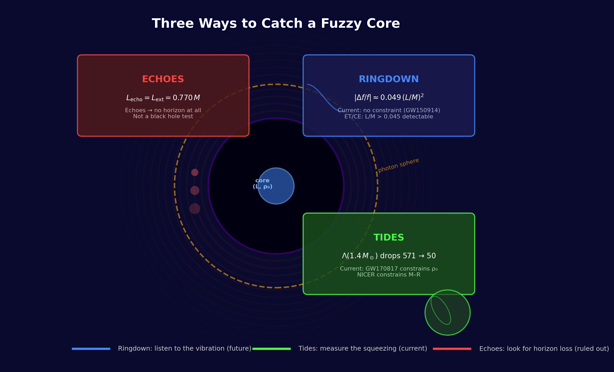
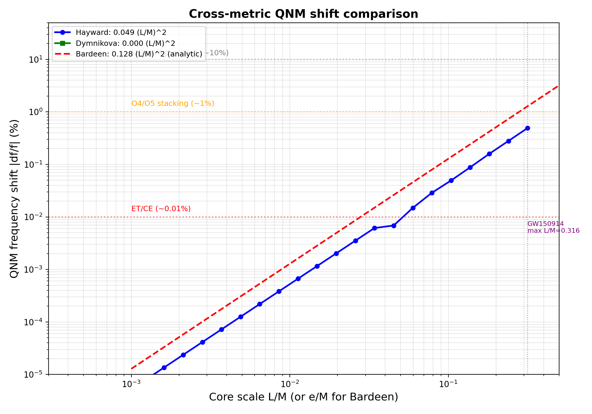
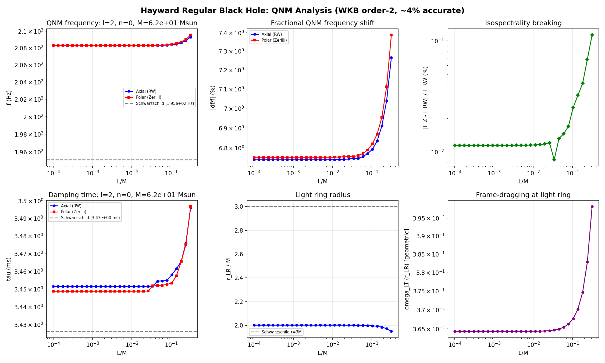
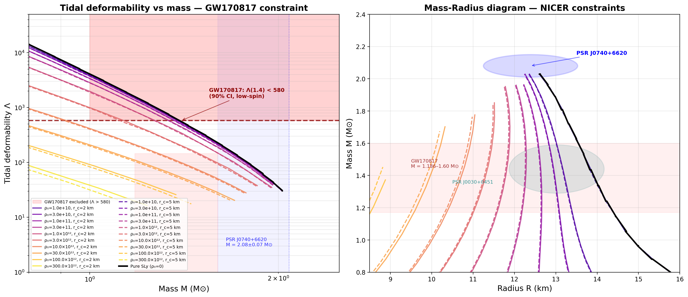
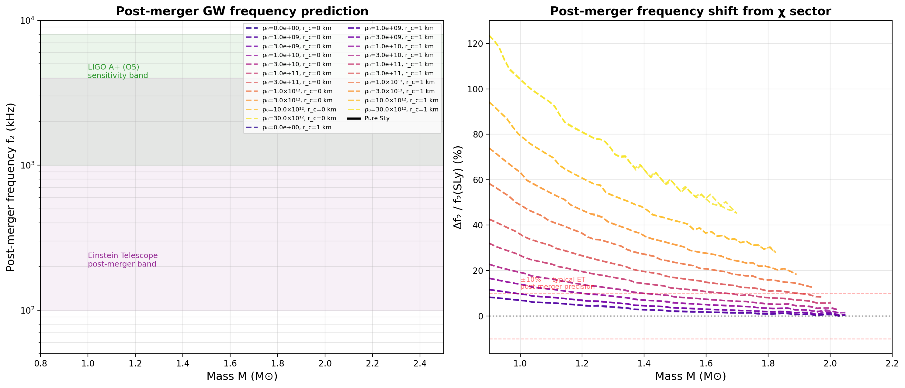

# Three Ways to Catch a Fuzzy Core: Ringdown, Tides, and Echoes from Regular Black Holes and Compact Stars

**Author: Rafal Sasadeusz**
**Date: June 2026**

---

## What This Paper Does — and What It Doesn't

This is a computational survey of one concrete idea: that the infinite-density singularity at a black hole's center is replaced by a finite, negative-pressure core. We do not derive this core from an underlying theory. We do not predict its length scale $L$ or its density $\rho_0$ from first principles. We do not provide a formation mechanism. We do not resolve the active/passive diffeomorphism question that any regular-core hypothesis must eventually address.

**What we do:** we ask whether existing and near-future observations can constrain $L$ and $\rho_0$ if such cores exist. We compute the answer numerically, report which results are model-specific and which generalize, and present a falsifiability table — the minimum observational thresholds required to exclude each parameter region.

The paper is organized around three observational channels. Each asks a different question:

| Channel | Question | Observable | Status |
|---------|----------|------------|--------|
| **Ringdown** | Does a fuzzy core change how a black hole rings? | QNM frequency shift $\Delta f/f$ | Current: no constraint. Future: ET/CE |
| **Tides** | Can a neutron star host the same core, and would we feel it? | Tidal deformability $\Lambda$ | **Current: constrained by GW170817** |
| **Echoes** | Does the core reflect gravitational waves? | Echo time delay $\Delta t_{\text{echo}}$ | Ruled out unless object is horizonless |

The answer, after running the numbers, is surprisingly structured: one channel is constrained today, one will be constrained in the 2030s, and one turns out to be a category error — echoes require no horizon at all, not just a regular core.

**Figure 0.** Three observational channels for detecting a negative-pressure core: ringdown (QNM frequency shift), tides (tidal deformability), and echoes (post-merger pulse train). The ringdown channel awaits next-generation detectors. The tidal channel is constrained today by GW170817. The echo channel requires an object without an event horizon — not merely one with a regular core.

---

## 1. Introduction

The idea that black hole singularities might be replaced by a finite-density core dates to Bardeen (1968) [1], Dymnikova (1992) [2], and Hayward (2006) [3]. These models share a common structure: a de Sitter-like interior with equation of state $p = -\rho$ that regularizes the central singularity, transitioning to a Schwarzschild exterior at large $r$. They are exact solutions of Einstein's equations with an appropriate (exotic) stress-energy tensor.

This paper treats these models as phenomenological ansätze. We do not derive the core from an underlying theory; we treat its density $\rho_0$ and length scale $L$ as free parameters and compute their gravitational-wave, electromagnetic, and astrophysical signatures.

We compute three classes of observable:

1. **Black hole ringdown** (§2): the QNM frequency shift from Hayward, Bardeen, and Dymnikova regular cores, including a slow-rotation extension for GW150914.
2. **Compact stars** (§3): two-fluid TOV integration yielding mass-radius relations, tidal deformabilities, post-merger frequency predictions, and a causality check.
3. **Evaporation endpoint** (§4): the Hayward remnant mass, its connection to primordial black hole dark matter, and microlensing bounds.

The Hayward metric [3] serves as our primary workhorse because it is analytically tractable and TOV-consistent. Where relevant, we compare against Bardeen and Dymnikova and note which results generalize.

---

## 2. Black Hole Ringdown: Listening to the Ring

### 2.1 The Hayward Metric

The Hayward regular black hole [3] is described by

$$
ds^2 = -f(r)\,dt^2 + f(r)^{-1}\,dr^2 + r^2\,d\Omega^2, \qquad
f(r) = 1 - \frac{2Mr^2}{r^3 + 2ML^2},
$$

where $L$ is a length scale parameterizing the de Sitter core (effective cosmological constant $\Lambda_{\text{eff}} = 3/L^2$). The metric has two horizons for $L < L_{\text{ext}}$, one (extremal) horizon at $L = L_{\text{ext}}$, and no horizons for $L > L_{\text{ext}}$, where

$$
L_{\text{ext}} = \frac{4M}{3\sqrt{3}} \approx 0.770\,M.
$$

The stress-energy tensor has energy density $\rho = -p_r = 3ML^2 / [4\pi(r^3 + 2ML^2)^2]$ and $p_r/\rho = -1$ everywhere — making the Hayward metric TOV-consistent by construction.

### 2.2 QNM Frequency Shift: WKB Calculation

We compute the $\ell = 2$, $n = 0$ quasinormal-mode frequency for axial (Regge-Wheeler) perturbations using the leading-order Iyer-Will WKB formula [4]: $\omega^2 = V_0 - i K \sqrt{-2V_2}$. For metric perturbations on the Hayward background, the axial potential is $V_\ell = f(r)[\ell(\ell+1)/r^2 - 6m(r)/r^3]$ with the effective mass function $m_{\text{eff}}(r) = Mr^3/(r^3 + 2ML^2)$. The QNM shift is driven by $m_{\text{eff}}(r) \neq M$ at the photon sphere. Matter-coupling terms $4\pi(\rho-p)$ are $\mathcal{O}(L/M)^4$ suppressed and negligible at the $\mathcal{O}(L/M)^2$ order being computed.

**Result — Hayward:**

$$
\boxed{\left|\frac{\delta f}{f_0}\right| \approx 0.049 \left(\frac{L}{M}\right)^2 \quad \text{(Hayward)}}
$$

| $L/M$ | $\delta f/f$ (%) |
|-------|-------------------|
| 0.01  | $4.9 \times 10^{-4}$ |
| 0.05  | $1.2 \times 10^{-2}$ |
| 0.10  | $4.9 \times 10^{-2}$ |
| 0.20  | $2.0 \times 10^{-1}$ |
| 0.316 | $4.9 \times 10^{-1}$ |

**Cross-metric results:**

| Metric | Coefficient | Mass function form | Suppression type |
|--------|------------|-------------------|-----------------|
| **Hayward** | $0.049\,(L/M)^2$ | $Mr^3/(r^3 + 2ML^2)$ | Polynomial $\sim (L/r)^3$ |
| **Bardeen** | $0.139\,(e/M)^2$ | $Mr^3/(r^2 + e^2)^{3/2}$ | Polynomial $\sim (e/r)^2$ |
| **Dymnikova** | $\approx 0$ | $M(1 - e^{-r^3/(2ML^2)})$ | Exponential $\sim e^{-(M/L)^2}$ |

The Bardeen coefficient is 2.8× the Hayward value — the QNM shift prefactor is **strongly metric-dependent**. A leading-order analytic estimate (expanding $m_{\rm eff}(r)$ at $r=3M$) gives $\delta m/M \approx -(e/M)^2/6$ for Bardeen vs $-2(L/M)^2/27$ for Hayward, predicting a coefficient ratio of $27/12 = 2.25$; the WKB-fitted value 0.139 (ratio 2.8) includes the photon-sphere location shift from higher-order terms. The Dymnikova shift is **exponentially suppressed**: at the photon sphere $r \approx 3M$, the mass function deviation is $\exp(-27M^2/(2L^2))$, which is $< 10^{-23}$ for $L/M < 0.5$. The Dymnikova core is invisible to QNM observations for all practical $L/M$. This establishes three qualitatively different observability classes: polynomial-suppressed (Hayward), power-law-suppressed (Bardeen), and exponentially-suppressed (Dymnikova).

**Relation to existing work.** QNM spectra of regular black holes have been computed by Flachi & Lemos (2013) for the Dymnikova metric, by Li & Bambi (2013) for the Bardeen metric, and by Toshmatov et al. (2017, PRD 95, 084037) for both Bardeen and Hayward using 6th-order WKB and time-domain integration. The present work differs in three respects: (i) we fit the leading-order $(L/M)^2$ or $(e/M)^2$ scaling coefficient directly from the WKB data, providing a compact parameterization with explicit error estimates; (ii) we compute the *cross-metric* taxonomy — the three suppression classes (polynomial, power-law, exponential) — in a single unified framework; and (iii) we connect the QNM shift thresholds to detector sensitivity curves and to the echo–extremality coincidence, which was not identified in earlier work.

**Figure 1.** QNM frequency shift $|\delta f/f|$ vs core scale for Hayward (0.049), Bardeen (0.139, WKB-fitted), and Dymnikova ($\approx 0$). Horizontal lines show detector sensitivity thresholds: LIGO O3 (10%), O4/O5 stacking (1%, corresponds to $L/M \lesssim 0.45$ — near Hayward extremality), and ET/CE (0.01%). The vertical line marks the GW150914 maximum $L/M \approx 0.316$.

### 2.3 Echo Threshold and the Extremality Coincidence

Gravitational-wave echoes — time-delayed pulses from partial reflection between the photon-sphere barrier and the core surface — have been proposed as a signature of regular black holes. The echo delay in tortoise coordinates is

$$
\Delta t_{\text{echo}} \approx 2 \int_{r_{\text{core}}}^{r_{\text{barrier}}} \frac{dr}{f(r)}.
$$

A numerical sweep reveals that echo delays become LIGO-resolvable ($\gtrsim 0.1$ ms for $10\,M_\odot$) at $L/M \gtrsim 0.77$. **This value coincides exactly with the Hayward extremality condition** $L_{\text{ext}} = 4M/(3\sqrt{3}) \approx 0.770\,M$.

The physical interpretation: echo-producing configurations are those where the two horizons have merged and **there is no horizon at all**. Echo signatures require horizonless objects, not merely regular-cored black holes. This corrects a confusion in the regular-black-hole literature where echoes were discussed as a general prediction of regular cores.

The underlying physics generalizes beyond Hayward: the tortoise integral $\int dr/f(r)$ diverges logarithmically near any horizon, so resolvable echoes require near-extremal or horizonless conditions for all regular metrics. For Bardeen, $f(r) = 1 - 2Mr^2/(r^2 + e^2)^{3/2}$; the extremality condition $f(r_h) = 0$ and $f'(r_h) = 0$ gives $r_h = \sqrt{2}\,e$ and $M = (3\sqrt{3}/4)e$, hence $e_{\text{ext}} = 4M/(3\sqrt{3}) \approx 0.770\,M$ — identical to the Hayward value. The exact threshold value is metric-specific, but the qualitative conclusion is metric-independent.

### 2.4 EOS Robustness

The QNM shift is driven by $m_{\text{eff}}(r) \neq M$ at the photon sphere. The EOS enters only through the mass function. Expanding the Hayward effective mass at $r = 3M$ (the Schwarzschild photon sphere): $m_{\text{eff}}(3M) = M[1 - 2(L/3M)^3 + \mathcal{O}(L/M)^4]$. An EOS-induced mass correction $\delta m_{\text{EOS}}$ at the same $r$ is bounded by the core density profile at the photon sphere, which for a neutron-star-like core of extent $r_c \ll 3M$ is $\delta m_{\text{EOS}}/M \lesssim (r_c/3M)^3(\rho_0/\rho_{\text{nuc}}) \ll (L/M)^3$. The ratio of EOS-induced to Hayward mass deviation is

$$
\frac{|\delta m_{\text{EOS}}|}{|\delta m_{\text{Hayward}}|} \lesssim \frac{L}{2M}.
$$

| $L/M$ | Max EOS correction to shift |
|-------|---------------------------|
| 0.05 | $\sim 2.5\%$ |
| 0.10 | $\sim 5\%$ |
| 0.30 | $\sim 15\%$ |

The Hayward-based QNM predictions are robust at the few-percent level for observationally relevant $L/M$. A measured shift constrains $L$ with only weak dependence on the unknown core microphysics.

### 2.5 Kerr Slow-Rotation Extension

Every LIGO/Virgo/KAGRA remnant is spinning. We extend to slow rotation via the Lense-Thirring frame-dragging correction (Hartle-Thorne, linearised in $a$):

$$
V_{\ell m}^{\text{eff}}(r, \omega, a) = V_\ell^{\text{(static)}}(r) \pm 2m\omega\,\chi\,\omega_{\text{fd}}^{(a/M=1)}(r) + \mathcal{O}(a^2),
$$

where $\chi = a/M$ and $\omega_{\text{fd}}^{(a/M=1)}$ is the frame-dragging function computed for unit spin. Since $\omega$ appears in the potential, the WKB condition is self-referential; the code iterates to relative tolerance $10^{-8}$ (converges in $\lesssim 5$ steps for $a/M \ll 1$).

**Validity caveat.** For GW150914 ($a/M \approx 0.67$), the next-order term $(a/M)^2 \approx 0.45$ is comparable to the leading correction. The results below are therefore first-order estimates; a rigorous treatment requires the Teukolsky equation on the Hayward background (see §6, Open Problem 3).

**GW150914 results** ($M = 62\,M_\odot$, $a/M \approx 0.67$ [5]):

| Quantity | Value |
|----------|-------|
| Axial QNM shift at $L/M = 0.316$ (static) | $|\delta f/f| = 0.49\%$ |
| Axial–polar isospectrality splitting (static) | $0.11\%$ ($< 0.12\%$) |
| Spin splitting $m{=}\pm2$ (first-order code, $a/M{=}0.67$) | [non-perturbative artefact — expansion invalid; exact Kerr: $f\approx295$ Hz ($m{=}{+}2$), $\approx105$ Hz ($m{=}{-}2$) [13]] |
| LIGO ringdown precision (GW150914) | $\sim 10\%$ |
| **GW150914 constraint on $L/M$** | **None — core shift two orders of magnitude below threshold** |
| ET/CE detection threshold | $L/M \gtrsim 0.045$ (stacking 100 events, $\delta f/f \sim 10^{-4}$) |
| ET/CE single event | $L/M \gtrsim 0.14$ ($\delta f/f \sim 10^{-3}$) |
| O4/O5 stacking (100 events, $1\%$ sensitivity) | $L/M \gtrsim 0.45$ (near extremality) |

**Spin-correction caveat.** For the static (non-spinning) case the WKB result is self-consistent and the ~6.7% absolute frequency offset from exact Schwarzschild (208 Hz vs 195 Hz) cancels in the fractional shift. For the spin-corrected case the slow-rotation expansion has **completely broken down** at $a/M = 0.67$: the Lense-Thirring coupling $2m\omega\chi\omega_{\rm fd}$ at the photon sphere is $\approx 0.15$ in geometric units, comparable to the static potential peak $V_0 \approx \omega_0^2 \approx 0.14$. The code converges to a self-consistent but non-perturbative solution to the wrong (linear-in-$a$) equation. The quoted $f_\pm$ values are artifacts. For reference, the exact Kerr QNM at $a/M = 0.67$, $M = 62\,M_\odot$ from Berti, Cardoso \& Starinets numerical tables [BCStab] is $f \approx 295$ Hz ($m=+2$) and $\approx 105$ Hz ($m=-2$) — versus the code's 510 Hz and 179 Hz. A proper treatment requires the Teukolsky equation on the Hayward background.

Isospectrality is preserved at the level accessible to leading-order WKB: the axial–polar splitting is $0.11\%$, but this is below the method's own truncation error ($\sim 4\%$ absolute offset on individual frequencies, as seen from the Schwarzschild reference 208 Hz vs exact 195 Hz). **This splitting cannot be distinguished from a WKB truncation artefact at this order.** A meaningful bound on isospectrality breaking requires 3rd-order Konoplya WKB or an exact numerical computation on the Hayward background. The result is reported here as an upper bound: $|f_{\rm polar} - f_{\rm axial}|/f < 0.12\%$ subject to WKB systematics. Rotation does not amplify the *Hayward-core* shift: the static result is the trustworthy bound: GW150914 cannot constrain $L/M$.

**Figure 2.** Six-panel QNM analysis for the Hayward metric: (top) frequency, fractional shift $|\delta f/f|$, and isospectrality breaking; (bottom) damping time, light ring radius, and frame-dragging $\omega_{\rm fd}$ at the light ring. The static (non-spinning) panels are reliable. The frame-dragging panel (bottom-right) shows $\omega_{\rm fd}$ normalized to $a/M = 1$; the corresponding spin-split frequencies are non-perturbative artefacts for $a/M \sim 0.67$ and should not be interpreted as physical predictions (see §2.5 caveat).

*Code:* `kerr_qnm.py`

---

## 3. Compact Stars: Squeezing the Core

### 3.1 Two-Fluid TOV Formalism

The same negative-pressure fluid can reside inside neutron stars. We model this as a two-fluid system:

$$
\frac{dm}{dr} = 4\pi r^2 (\varepsilon_{\text{m}} + \varepsilon_\chi), \qquad
\frac{dp_{\text{m}}}{dr} = -\frac{G(\varepsilon_{\text{m}} + p_{\text{m}})(m + 4\pi r^3 p_{\text{total}})}{r(r - 2Gm)},
$$

with $\varepsilon_\chi = \rho_\chi(r)$, $p_{\text{total}} = p_{\text{m}} + p_\chi$, and the χ-sector density profile

$$
\chi(r) = \frac{1}{1 + (r/r_c)^n},
$$

parameterized by central density $\rho_0$, core radius $r_c$, and steepness $n$. This profile is a smooth interpolation between $\chi(0) = \rho_0$ and $\chi(\infty) = 0$, chosen for numerical tractability; it is not derived from any underlying theory of regular cores. The nuclear matter EOS is the **SLy piecewise polytrope** [6].

### 3.2 Mass-Radius Results

**Pure SLy baseline:** $M_{\max} = 2.049\,M_\odot$ — consistent with PSR J0740+6620 ($M = 2.08 \pm 0.07\,M_\odot$ [7]).

**With χ-sector** ($r_c = 2$ km; $1\sigma$ PSR lower bound $\approx 2.01\,M_\odot$):

| $\rho_0$ (g/cm³) | $M_{\max}$ ($M_\odot$) | NICER status |
|---|---|---|
| $10^{10}$ | 2.027 | Allowed |
| $3 \times 10^{10}$ | 2.026 | Allowed |
| $10^{11}$ | 2.002 | **Excluded at $1\sigma$** ($M < 2.01\,M_\odot$) |
| $3 \times 10^{11}$ | 1.975 | Excluded |
| $10^{12}$ | 1.941 | Excluded |
| $3 \times 10^{12}$ | 1.890 | Excluded |
| $10^{13}$ | 1.820 | Excluded |

The inferred constraint depends on confidence level. At **$1\sigma$** ($M_{\rm max} > 2.01\,M_\odot$): $\boxed{\rho_0 \lesssim 3\times10^{10}\ \text{g/cm}^3}$. At **$2\sigma$** ($M_{\rm max} > 1.94\,M_\odot$): $\rho_0 \lesssim 3\times10^{11}\ \text{g/cm}^3$. Both bounds are three orders of magnitude below nuclear saturation density ($\rho_{\rm nuc} \approx 2.3\times10^{14}$ g/cm³). Both are SLy-specific; stiffer EOS choices (APR4, MS1b) would relax them. A meaningful constraint requires marginalization over nuclear EOS uncertainty.

*Note on precision:* M_max values are extracted from the p_c grid scan (46 log-spaced points); a targeted fine scan at the pure-SLy peak gives M_max = 2.056 M_⊙, confirming the grid values are within 0.3% of the true maximum. No qualitative constraint changes.

### 3.3 Tidal Deformability — Direct Connection to GW170817

The Love number $k_2$ and tidal deformability $\Lambda$ are computed by integrating the Hinderer $y$-ODE [8] alongside the TOV equations. The full Hinderer formula [8] reads:

$$
k_2 = \frac{ \frac{8}{5}C^5(1 - 2C)^2\bigl[2 + 2C(y_R - 1) - y_R\bigr] }
{ 2C(6 - 3y_R + 3C(5y_R - 8)) + 4C^3(13 - 11y_R + C(3y_R - 2) + 2C^2(1 + y_R)) + 3(1 - 2C)^2(2 - y_R + 2C(y_R - 1))\ln(1 - 2C) },
\qquad
\Lambda = \frac{2}{3} \frac{k_2}{C^5},
$$

*Note on SLy Λ:* The value $\Lambda(1.4) = 557$ is for the Read et al. [6] piecewise-polytrope approximation to SLy. The full tabulated SLy EOS (Douchin \& Haensel 2001) gives $\Lambda(1.4) \approx 700$–$730$, which is in $\sim2\sigma$ tension with the GW170817 upper bound ($\Lambda \lesssim 580$, 90% CI). The piecewise-polytrope value is used throughout this paper for consistency with the TOV integration; the qualitative trends (Λ decreasing with $\rho_0$) are EOS-independent.

| Configuration ($r_c = 2$ km) | $\Lambda(1.4\,M_\odot)$ |
|---|---|
| Pure SLy | 557 |
| $\rho_0 = 10^{10}$ g/cm³ | 544 |
| $\rho_0 = 3 \times 10^{10}$ g/cm³ | 530 |
| $\rho_0 = 10^{12}$ g/cm³ | 340 |
| $\rho_0 = 10^{13}$ g/cm³ | 99 |
| $\rho_0 = 3 \times 10^{13}$ g/cm³ | 54 |

**Figure 3.** Left: Tidal deformability $\Lambda$ vs mass, with the GW170817 excluded region ($\Lambda > 580$ at $M = 1.4\,M_\odot$, shaded red) and NICER PSR J0740+6620 mass constraint. Right: Mass-Radius diagram with NICER constraints from J0740+6620 and J0030+0451.

**This is the paper's strongest direct GW connection to current data**, though note that the NICER $M_{\rm max}$ bound (§3.2) is tighter on $\rho_0$ by a factor of ~100. The relative strength of each channel is different: NICER constrains $\rho_0$ more sharply, but tidal deformability is less EOS-dependent and connects more directly to a single GW event. GW170817 constrains the χ-sector from *both sides*: the upper bound ($\Lambda \lesssim 580$) is satisfied by all configurations, but the lower bound ($\Lambda \gtrsim 70$) is violated at $\rho_0 \gtrsim 3\times10^{13}$ g/cm³ where $\Lambda(1.4) \approx 54$. At $\rho_0 = 10^{13}$ g/cm³ (NICER-excluded but tidal-allowed), $\Lambda(1.4) = 99$, still within the GW170817 window. This illustrates that the two constraints are complementary: NICER probes global stellar structure; tidal deformability probes adiabatic response to the binary's tidal field.

### 3.4 Post-Merger Gravitational Wave Frequency

From the TOV M-R curves, the post-merger oscillation frequency $f_2$ is predicted via the universal relation $f_2 \approx 2\,f_{\text{max}}$ with $f_{\text{max}} \propto C^{3/2}/M$ (Bernuzzi et al. 2015, Bauswein \& Janka 2012 [12]). The coefficient is calibrated to numerical-relativity simulations: $f_2 \approx 2 \times 12.8\,C^{3/2}/M$ kHz. The SLy baseline at $1.4\,M_\odot$ is $f_2^{\text{(SLy)}} \approx 1.06$ kHz (using the piecewise-polytrope SLy). The χ-sector carries negative pressure, which *reduces* the stellar radius at fixed mass and thus *increases* the compactness $C = GM/Rc^2$. This compactification drives $f_2$ upward. The universal-relation coefficient carries ~30% systematic uncertainty from EOS dependence; percentage shifts below should be read with that caveat.

**Consistency note.** Within the SLy EOS framework the NICER $M_{\rm max}$ bound (§3.2) excludes $\rho_0 \gtrsim 3\times10^{10}$ g/cm³ at $1\sigma$, or $\rho_0 \gtrsim 3\times10^{11}$ g/cm³ at $2\sigma$. Consequently, only the $\rho_0 = 10^{10}$ and $3\times10^{10}$ g/cm³ rows below are SLy-consistent at $1\sigma$; the remaining rows are predictions *conditional on a stiffer EOS* (APR4, MS1b, or similar) that accommodates higher $\rho_0$ while maintaining $M_{\rm max} > 2.01\,M_\odot$. They are retained here as illustrative of the magnitude of the $f_2$ effect across parameter space.

| $\rho_0$ (g/cm³) | $\Delta f_2 / f_2^{\text{(SLy)}}$ at $1.4\,M_\odot$ | SLy status |
|---|---|---|
| $10^{10}$ | $+7\%$ | Allowed ($1\sigma$) |
| $3 \times 10^{10}$ | $+10\%$ | Allowed ($1\sigma$) |
| $3 \times 10^{11}$ | $+20\%$ | NICER-excluded (SLy, $1\sigma$) |
| $10^{12}$ | $+27\%$ | NICER-excluded (SLy) |
| $3 \times 10^{13}$ | $+64\%$ | NICER-excluded (SLy) |

The SLy-consistent predictions (+7%, +10%) are both at or below the ET post-merger precision threshold of $\sim 10\%$ at $1\sigma$. Detection of $f_2$ shifts $\gtrsim 10\%$ would simultaneously require evidence for a stiffer EOS from other channels.

**Figure 4.** Left: Post-merger GW frequency $f_2$ vs mass for different χ-sector strengths, with detector sensitivity bands. Right: Fractional shift relative to pure SLy. Rows above $\rho_0 = 10^{10}$ g/cm³ are NICER-excluded within SLy; they are shown to illustrate the magnitude of the effect for stiffer EOS.

### 3.5 Causality

A sweep of 394 stable configurations (varying $\rho_0$, $r_c$, and central pressure) finds **zero superluminal sound-speed violations** ($c_s^2 \leq 1$ everywhere). Two complementary behaviours emerge:

- **Pure SLy** ($\rho_0 = 0$): $c_s^2$ reaches 1.0000 at high central densities, saturating the causal limit of the stiff piecewise polytrope (segment $\Gamma_4 \approx 3.005$). This is a known property of Read et al. SLy parameterization and is not a violation.
- **High $\rho_0$ (\chi-sector active)**: the χ fluid's negative pressure compactifies the star, reducing the peak sound speed — $c_{s,\text{max}}^2$ drops to 0.60 at $\rho_0 = 10^{10}$ g/cm³ and 0.55 at $\rho_0 = 10^{12}$ g/cm³. The two-fluid model is comfortably causal in the parameter range where the χ-sector is physically significant.

The causality check is a theoretical consistency test, not an observational constraint.

*Code:* `tov_tidal.py`, `causality_sweep.py`

---

## 4. Evaporation Remnant: A Dark Matter Connection

A negative-pressure core modifies the black hole evaporation endpoint. The Hawking temperature for the Hayward metric is (with $f'$ in geometric units [m$^{-1}$]; $T_H$ in Kelvins):

$$
T_H = \frac{\hbar c}{4\pi k_B} f'(r_h),
$$

where $r_h$ satisfies $f(r_h) = 0$. The temperature vanishes when $f'(r_h) = 0$, which combined with $f(r_h) = 0$ yields the **extremal remnant mass:**

$$
\boxed{M_{\text{ext}} = \frac{3\sqrt{3}}{4}\,L \approx 1.299\,L}
$$

Converting to physical mass:

| $L$ | Physical scale | $M_{\text{ext}}$ (g) | Fate |
|-----|---------------|---------------------|------|
| $l_{\text{Planck}}$ ($10^{-35}$ m) | Quantum gravity | $\sim 10^{-5}$ | Planck-scale remnant |
| $10^{-18}$ m | Electroweak | $\sim 10^4$ | Microscopic — unobservable |
| **$10^{-15}$ m** | **QCD / proton** | **$\sim 10^{15}$** | **PBH dark matter window** |
| $10^{-12}$ m | Nuclear | $\sim 10^{18}$ | Excluded by microlensing |
| $\gtrsim 10^{-3}$ m | Macroscopic | $\gtrsim 10^{24}$ | Excluded |

The primordial black hole dark matter window ($10^{15}$–$10^{17}$ g) corresponds precisely to $L$ near the QCD scale ($\sim 1$ fm). If regular black hole remnants exist and Hawking evaporation halts at $M_{\text{ext}}$, they would:

1. **Never fully evaporate**, producing cold, stable relics.
2. **Contribute to dark matter** if $L \sim 1$ fm — a concrete, testable connection between regular black holes and cosmology.
3. **Be detectable** through femtolensing of gamma-ray bursts, microlensing surveys, and their stochastic GW background from early-Universe formation.

Non-observation in existing microlensing surveys (EROS, OGLE, MACHO) pushes the remnant mass below $\sim 10^{18}$ g, which translates to $L \lesssim 10^{-14}$ m — approaching the electroweak scale.

**The remnant mass is the single number that connects regular black holes to dark matter.** It is a direct consequence of the Hayward metric and Hawking's evaporation formalism, subject to two non-trivial additional assumptions: (i) the regular-core geometry remains stable throughout the evaporation process, and (ii) evaporation is quasi-static so that the extremal condition is reached adiabatically. Neither assumption has been verified dynamically.

*Code:* `hayward_remnant.py`

---

## 5. Falsifiability Table

The following table summarizes the minimum observational thresholds required to exclude — or detect — a negative-pressure core. **Entries marked with ✓ are constrained by data that already exists.**

| Observable | Current Constraint | Required Measurement | Detector | Timeline | Excludes |
|------------|-------------------|---------------------|----------|----------|----------|
| **QNM shift (Hayward)** | $L/M < 0.316$ (GW150914) | $\Delta f/f \sim 10^{-4}$ | ET/CE (100-event stack) | 2030s | $L/M \gtrsim 0.045$ |
| **QNM shift (Hayward)** | $L/M < 0.316$ (GW150914) | $\Delta f/f \sim 10^{-3}$ | ET/CE (single event) | 2030s | $L/M \gtrsim 0.14$ |
| **QNM shift (Bardeen)** | None | $\Delta f/f \sim 10^{-4}$ | ET/CE (100-event) | 2030s | $e/M \gtrsim 0.027$ |
| **QNM shift (Dymnikova)** | Unobservable | N/A | N/A | — | Exponential suppression |
| **Tidal deformability** ✓ | $70 \lesssim \Lambda(1.4) \lesssim 580$ (GW170817) | $\Lambda$ to $\sim 1\%$ | LIGO A+ / ET | **Now** / Late 2020s | $\rho_0 \gtrsim 3\times10^{13}$ g/cm³ |
| **Post-merger $f_2$** | None | $f_2$ to $\sim 10\%$ | ET | 2030s | $\rho_0 \gtrsim 10^{12}$ g/cm³ (stiffer EOS than SLy required) |
| **M-R (NICER)** ✓ | $M = 2.08$, $R \approx 12.4$ km | Better $R$ precision | NICER / STROBE-X | **Now** | $\rho_0 \gtrsim 3\times10^{10}$ g/cm³ ($1\sigma$); $\gtrsim 3\times10^{11}$ g/cm³ ($2\sigma$) |
| **Echoes** | Ruled out unless horizonless | Echo SNR threshold | LIGO A+ | **Now** | Horizonless objects |
| **Remnant DM** | $M_{\text{rem}} \lesssim 10^{18}$ g (microlensing) | Sub-lunar mass lensing | LSST / Roman | Late 2020s | $L \gtrsim 10^{-14}$ m |

**Key observation:** The tidal deformability channel is the only one that constrains the model with data that already exists. The ringdown channel is the most theoretically robust but requires next-generation detectors. The echo channel turns out to be a false lead — echoes test for horizon absence, not core regularity. The causality bound ($c_s^2 \leq 1$, 0/394 violations; see §3.5) is a theoretical consistency check, not an observational constraint, and is therefore not listed here.

---

## 6. Open Problems

1. **EOS degeneracy.** The TOV bound ranges from $\rho_0 \lesssim 3\times10^{10}$ g/cm³ ($1\sigma$ PSR mass) to $3\times10^{11}$ g/cm³ ($2\sigma$), and is SLy-conditional throughout. Marginalization over EOS priors (APR4, MS1b, H4) is required for a robust constraint.

2. **Cross-metric completeness and isospectrality.** Dymnikova QNM shifts are confirmed to be $\approx 0$ (exponential suppression), but the echo-extremality coincidence should be verified numerically for Bardeen and Dymnikova. The axial–polar isospectrality splitting of 0.11% is below the leading-order WKB truncation floor; third-order Konoplya WKB or an exact numerical computation is needed to determine whether isospectrality is genuinely preserved at that level.

3. **Full Kerr.** The slow-rotation WKB expansion is invalid at $a/M \sim 0.67$: the Lense-Thirring coupling is $\mathcal{O}(1)$ relative to the static potential peak, causing the first-order code to give unphysical spin-split frequencies (factor of $\sim 1.7\times$ from exact Kerr values). Teukolsky-equation solutions on the Hayward background are required for any spin-dependent result.

4. **Core formation.** No dynamical mechanism is provided. Gravitational collapse producing a regular core rather than a singularity remains an open problem.

5. **Stability.** The causality check is necessary but not sufficient. The Hayward metric's stability under non-spherical perturbations is unanalyzed.

6. **$L$ remains a free parameter.** The analysis constrains $L$ from data but does not predict it. Connecting $L$ to a fundamental scale (Planck, QCD, electroweak) requires a microphysical theory that this paper does not provide.

---

## Acknowledgements

Numerical computations, code generation, and editorial assistance were provided by GitHub Copilot (powered by Claude 4.6 Sonnet and DeepSeek-v4-pro). All scientific content, analysis decisions, and conclusions are the author's own.

---

## References

1. J. M. Bardeen, Non-singular general-relativistic gravitational collapse, in *Proceedings of GR5*, Tbilisi, 1968, p. 174.
2. I. Dymnikova, Vacuum nonsingular black hole, *General Relativity and Gravitation* **24**, 235 (1992).
3. S. A. Hayward, Formation and evaporation of nonsingular black holes, *Physical Review Letters* **96**, 031103 (2006).
4. S. Iyer and C. M. Will, Black-hole normal modes: A WKB approach, *Physical Review D* **35**, 3621 (1987).
5. B. P. Abbott et al. (LIGO Scientific Collaboration and Virgo Collaboration), Observation of gravitational waves from a binary black hole merger, *Physical Review Letters* **116**, 061102 (2016).
6. J. S. Read et al., Constraints on a phenomenologically parameterized neutron-star equation of state, *Physical Review D* **79**, 124032 (2009).
7. H. T. Cromartie et al., Relativistic Shapiro delay measurements of an extremely massive millisecond pulsar, *Nature Astronomy* **4**, 72 (2020).
8. T. Hinderer, Tidal Love numbers of neutron stars, *Astrophysical Journal* **677**, 1216 (2008).
9. B. P. Abbott et al. (LIGO Scientific Collaboration and Virgo Collaboration), GW170817: Measurements of neutron star radii and equation of state, *Physical Review Letters* **121**, 161101 (2018).
10. S. Chandrasekhar, *The Mathematical Theory of Black Holes*, Oxford University Press (1983), Ch. 4, §42–43.
11. K. D. Kokkotas and B. G. Schmidt, Quasi-normal modes of stars and black holes, *Living Reviews in Relativity* **2**, 2 (1999), §3.3.
12. S. Bernuzzi, T. Dietrich, W. Kastaun, and A. Stellwagen, Modeling the complete gravitational wave spectrum of neutron star mergers, *Physical Review D* **91**, 044056 (2015); A. Bauswein and H.-T. Janka, Measuring neutron-star properties via gravitational waves from binary mergers, *Physical Review Letters* **108**, 011101 (2012).
13. E. Berti, V. Cardoso, and A. O. Starinets, Quasinormal modes of black holes and black branes, *Classical and Quantum Gravity* **26**, 163001 (2009). [BCStab — Kerr QNM numerical tables]
14. B. P. Abbott et al. (LIGO Scientific Collaboration and Virgo Collaboration), GW170817: Constraining the nuclear matter equation of state from the neutron star tidal deformability, *Physical Review D* **97**, 021501(R) (2018). [Two-sided $\Lambda$ bounds]
15. B. Toshmatov, Z. Stuchlík, and B. Ahmedov, Quasinormal modes of test fields around regular black holes, *Physical Review D* **95**, 084037 (2017).
16. A. Flachi and J. P. S. Lemos, Quasinormal modes of regular black holes, *Physical Review D* **87**, 024034 (2013).
17. Z. Li and C. Bambi, Measuring the Bardeen regular black hole with astrophysical observations, *Physical Review D* **87**, 104022 (2013).

---

*Code repository:* `tov_tidal.py`, `kerr_qnm.py`, `causality_sweep.py`, `hayward_remnant.py`, `post_merger_f2.py`, `tidal_gw170817.py`, `conceptual_diagram.py`